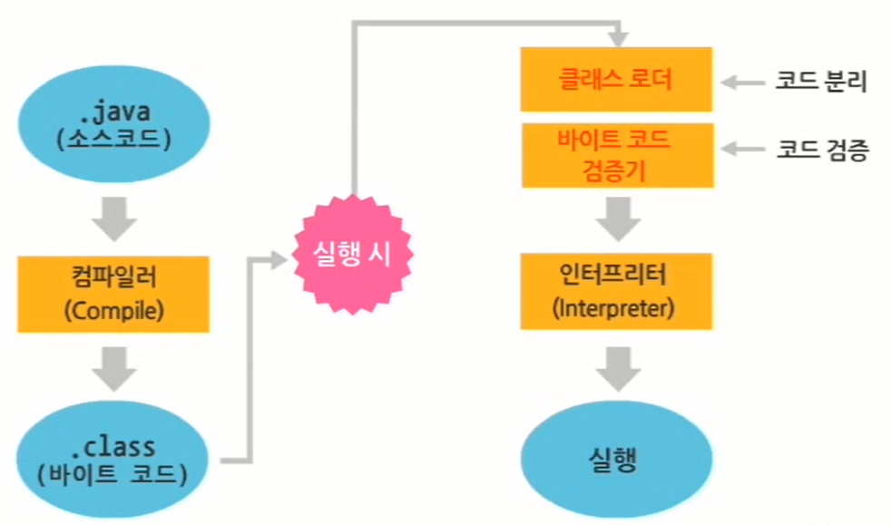
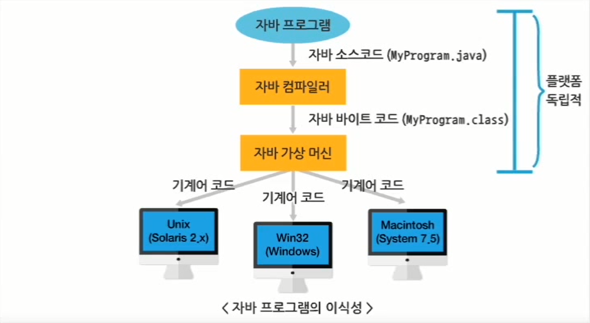
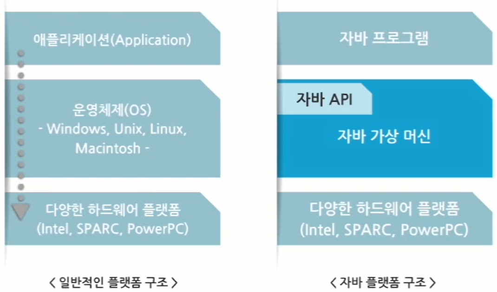

# 자바 프로그램 개요 및 실습 환경 구축

# 1. 자바 프로그램 개요 및 실습환경 구축

## 1.1 자바 프로그램 기초

### 1.1.1 자바 언어의 탄생 배경

- 1991년
    - Green Project에서 가정용 전자기기에서 사용되는 작은 컴퓨터 언어를 디자인함
        - 가정용 전자기기에 사용되는 언어는 작고 견고해야 하며, 신뢰할 수 있는 코드를 필요로 함
        - 다른 CPU가 선택될 수 있기 때문에 특정 디바이스에 종속되지 않아야 함
    
    ⇒ Virtual Machine에서 동작하는 중간코드를 생성하여 이식성이 높은 언어를 디자인함
    
- 1992년
    - 절차지향 언어와 객체지향 언어를 혼용해서 사용했던 C++ 언어를 기반으로 개발
    - C++ 언어의 한계로 인해 Oak라는 왑벽한 객체지향 언어를 개발하게 됨
      
        → 이미 Oak라는 프로그램이 존재해서 이후 Java라고 명칭이 변경됨
    
- 1994년
    - World Wide Web(WWW)의 발전과 Mosaic의 사용에 주목하여 자바를 기반으로 한 웹 브라우저 제작
      
        → HotJava 브라우저로 발전
        
    - HotJava
        - Applet이라 불리는 자바의 기능을 보여주기 위해 브라우저가 중간코드(Bytecode)를 해석할 수 있도록 만듦
        - 1995년 5월 23일 Sun World ‘95에서 공식 발표
- 1996년
    - Netscape 2.0에서부터 자바가 지원됨
    - IBM, Symantec, Inprise, MS 등 많은 업체들이 자바를 지원하게 됨
    - 자바 버전 1.2가 출시되면서 자바 2 플랫폼으로 명명됨

### 1.1.2 자바 언어의 특징

- 단순함(Simple)
    - C 언어와 C++ 언어의 복잡한 기능을 제외하여 코드를 단순하게 작성할 수 있음
    - Garbage Collector에 의한 자동 메모리 관리로 할당된 메모리 해제를 신경쓰지 않아도 됨
        - Garbage Collector : 더 이상 사용되지 않는 객체를 쓰레기로 간주하여 메모리에서 자동으로 정리
- 객체지향(Object-Oriented)
    - 자바는 객체지향 개념이 적용된 C++을 기초로 하여 만들어진 언어
      
        ⇒ 언어라는 객체를 사용해서 프로그램을 작성하도록 하는 언어
        
    - 객체지향을 하게 되면 재사용성(Reusability)을 높일 수 있음
        - 단순히 코드 재사용을 넘어서 객체의 재사용을 뜻함
        - 프로그램 개발에 필요한 필요한 수많은 클래스 라이브러리들을 API로 제공
- 분산처리(Distributed)에 용이
    - 분산 환경에서 TCP/IP 등의 프로토콜을 통해 효율적으로 실행될 수 있도록 설계된 언어
        - TCP/IP 네트워크 기능 내장
        - HTTP, FTP 등과 같은 프로토콜을 쉽게 사용할 수 있도록 라이브러리 제공
    - 서로 다른 컴퓨터 상의 객체들도 원격으로 호출하여 실행할 수 있는 원격 메서드 호출과 관련된 RMI(Remote Method Invocation) 기능의 라이브러리 제공
- 인터프리터(Interpreter)에 의해 실행
    - 자바 프로그램의 실행 과정
        1. 소스코드 `.java`
        2. 컴파일러에서 Compile
        3. 중간코드 `.class`
           
            (클래스 파일 또는 바이트 코드라고 함)
            
        4. 인터프리터에 의해 기계어로 해석되어 실행
           
            기계어 : 컴퓨터가 사용하는 언어
        
    - 컴파일 언어임과 동시에 인터프리터 언어
- 견고(Robust)
    - 다양한 플랫폼(컴퓨터) 상에서 실행되기 위해서는 높은 신뢰성이 요구되는데 자바는 이를 위해 에러의 원인이 되는 요소들을 제거하거나 자동으로 해결
        - 포인터를 사용하지 않음
        - 자동으로 Garbage Collector 기능 수행
        - 엄격한 데이터 타입의 검사를 통해 에러를 조기에 발견함
        - 실행 시간에 발생하는 에러를 처리
- 안전(Secure)
    - 컴파일 시에 엄격하게 데이터 타입을 검사함으로써 프로그램 실행 시 발생할 수 있는 비정상적인 상황을 미리 방지
    
    
    
    - 클래스 로더와 바이트 코드 검증기가 신뢰도를 높여줌
- 플랫폼 독립적(Architecture Neutral)
    - 사용하는 운영체제나 CPU 등의 하드웨어 사양에 관계없이 실행될 수 있음
      
        
    
- 높은 성능(High Performance)
    - Garbage Collection 기능이 추가되어 있어 자동으로 메모리 관리가 가능
        - 메모리가 할당된 객체의 상태를 추적 관리
        - 더 이상 참조되지 않으면 자동으로 할당된 메모리 해제
- 멀티스레드(Multithread)
    - 스레드(Thread) : 독자적으로 수행하는 하나의 작은 프로그램
    - 멀티스레드(Multi-thread) : 한 번에 여러 개의 스레드가 동시에 수행되는 과정
        - 하나의 CPU가 여러 개의 프로그램을 동시에 수행하도록 하여 수행 속도를 빠르게 함
- 동적(Dynamic)
    - 자바 언어는 변화되는 환경에 잘 적응되도록 설계됨
    - 기존의 프로그램에 영향을 주지 않고, 라이브러리에 새로운 메서드나 속성들을 추가할 수 있음
    - 프로그램과 프로그램에서 사용되는 라이브러리와의 연결을 실행시간에 수행함
      
        → 라이브러리의 변화를 곧바로 적용할 수 있음
        

### 1.1.3 자바 플랫폼

- 플랫폼(Platform)의 개념
    - 프로그램이 실행될 수 있는 하드웨어 및 소프트웨어 환경을 의미
    - 일반적인 플랫폼은 컴퓨터 하드웨어와 하드웨어를 제어하는 운영체제로 구성
    - 자바 플랫폼은 소프트웨어만으로 구성되어 JDK(Java Development Kit)로 설치
        - Java SE
        - Java EE
        - Java ME
- 자바 플랫폼 종류
    1. Java SE(Java 2 Platform Standard Edition)
        - 가장 기본이 되는 에디션
        - 자바 언어 대부분의 패키지가 포함됨
    2. Java EE(Java 2 Platform Enterprise Edition)
        - 현업에서 사용되는 API들이 집약된 에디션
        - JSP, Servlet, JDBC, JNDI, JTA, EJB 등의 많은 기술들이 포함됨
    3. Java ME(Java 2 Platform Micro Edition)
        - 모바일 기기 등에서 사용되는 API 가 포함된 에디션
        - 스마트폰의 자체적인 OS로 인해 자체 API(안드로이드 SDK, Ios SDF)의 사용으로 인해 현재는 거의 사장됨
- 자바 플랫폼의 구조
  
    
    
- 자바 가상 머신(Java Virtual Machine; JVM)
    - 일반적인 프로그램은 같은 기능의 프로그램이어도 운영체제가 다르면 다르게 제작되어야 함
    - 자바 가상 머신은 자바 언어로 쓰여진 애플리케이션을 실행시키는 기능 수행
    - 자바로 쓰여진 애플리케이션과 특정 운영체제 중간에 존재하여 서로를 분리
      
        ⇒ 애플리케이션이 운영체제에 영향을 받지 않고 동작할 수 있는 환경 제공
        
    - 단, JVM은 운영체제와 직접적으로 통신해야 하기 때문에 운영체제에 맞는 JVM을 설치해주어야 함
- 자바 API(Application Programming Interface)
    - 프로그래머가 필요로 하는 기본적인 클래스들을 거대한 라이브러리로 미리 만들어서 제공하는 것
    - 미리 제공되는 클래스를 표준 클래스라고 함
    - 자바 언어 자체는 작고 단순한 구조를 갖지만 많은 기능들을 API에서 제공하고 있음
- 자바 주요 패키지
    1. java.applet
        - 애플릿 작성에 필요한 기능을 모아 놓은 패키지
    2. java.awt
        - GUI 작성과 관련된 패키지
        - javax.swing 패키지와 함께 자바 GUI 애플리케이션 작성 시 필수적으로 사용함
        - 버튼, 텍스트 필드, 메뉴 등 관련 컴포넌트와 이벤트 기능을 제공함
    3. java.io
        - 자바 입출력 기능과 관련된 패키지
        - 파일이나 버퍼 등의 입출력 기능을 제공함
    4. java.lang
        - 자바 언어의 기초적인 사항을 정의한 클래스와 관련된 패키지
        - Object 클래스, 문자열 관련, 시스템 관련, 멀티스레드 관련 기본적인 기능을 포함함
    5. java.net
        - 자바의 네트워크에 관련된 패키지
        - 소켓과 관련된 기능을 제공
    6. javax.swing
        - java.awt 패키지와 더불어 GUI 애플리케이션 기능과 관련된 패키지
        - java.awt 포함 내용보다 다양하고 융통성 있는 컴포넌트를 제공함
    7. java.util
        - 유틸리티성 기능과 관련된 패키지
        - 날짜 표현이나 여러 자료형을 하나로 취급하는 컬렉션과 관련된 기능을 제공함

## 1.2 실습 환경 구축

### 1.2.1 JDK 설치

- JDK
    - 자바 프로그램 개발을 위한 자바 개발 환경(Java Development Kit; JDK) 설치
    - 사용하려는 분야에 따라 세 가지 플랫폼으로 구분됨
    - 개발 및 실행에 필요한 모든 도구가 들어있음
- JRE
    - 실행 환경(Java Runtime Environment)
    - JDK에서 몇 가지 도구를 제외한, 실행만을 위한 도구들로 구성
    - JRE만으로는 작성된 소스를 컴파일할 수 없으므로 컴파일러를 포함한 SDK(Software Development Kit)를 설치해야 함
- SDK
    - JDK와 SDK는 동일한 의미의 용어
    - JDK 1.2 버전부터 JDK를 SDK라는 용어와 혼용해서 부름
    - 상당히 많은 API 추가되어서 새로운 개념의 JDK라는 의미로 SDK라고 부름
- JDK 설치
    1. [http://www.oracle.com/index.html](http://www.oracle.com/index.html) 접속
    2. Downloads 화면에서 윈도우용 JDK 1.6 버전을 다운로드
    3. 다운로드한 JDK 1.6 설치 파일 실행
    4. JDK 1.6 버전을 설치할 폴더를 설정
- JDK 설치 폴더 구조
    - bin : 자바 개발 환경과 관련된 각종 명령들을 포함한 폴더(컴파일러와 인터프리터 명령도 포함)
    - include : 플랫폼 별로 필요한 JDK의 각종 헤더 파일들을 포함한 폴더
    - jre : 자바 실행 환경 관련 명령어와 라이브러리를 포함한 폴더
    - lib : 자바 개발 환경에서 사용될 라이브러리를 포함한 폴더
- 주요 자바 명령어
    1. Javac
        - 자바 컴파일러
        - 사용법 : javac [옵션] 자바 소스 파일명.java
        - 기능 : 자바 소스를 자바 바이트 코드로 번역
    2. java
        - 자바 애플리케이션 인터프리터
        - 사용법 : java [옵션] 자바 클래스 파일명 [매개변수 리스트]
        - 기능 : 자바 애플리케이션 클래스를 해석하여 실행 결과를 보여줌
    3. appletviewer
        - 자바 애플릿 뷰어
        - 사용법 : appletviewer [옵션] url을 포함하는 html 파일명.html
        - 기능 : 자바 애플릿을 실행하는 일종의 작은 웹 브라우저
    4. jdb
        - 자바 디버거
        - 사용법 : jdb 자바 클래스 파일명
        - 기능 : 프로그램 버그를 해결하기 위한 디버거
    5. javadoc
        - 자바 문서 생성기
        - 사용법 : javadoc [옵션] 자바 소스 파일명.java
        - 기능 : 자바 소스 파일에 대한 html 파일을 생성하고, 소스 프로그램의 클래스나 인터페이스, 생성자, 메서드, 클래스 계층 구조에 대한 html 파일을 생성함
    6. javap
        - 자바 역컴파일러
        - 사용법 : javap [옵션] 자바 클래스 파일명
        - 기능 : 컴파일 후 생성된 자바 클래스 파일을 역컴파일하여 클래스 내의 정보를 추적할 수 있도록 함
    7. jar
        - 자바 파일 압축기
        - 사용법 : jar [옵션] jar 파일명 압축할 자바 파일 리스트
        - 기능 : 다수 개의 자바 클래스 파일들을 하나의 .jar라는 파일로 압축하여 네트워크를 통한 프로그램 전송 시 전송 시간을 줄일 수 있음
- 환경 변수 설정
    - JDK 설치 폴더 안의 bin의 명령어는 bin 폴더 안에서만 사용 가능
      
        → 시스템 환경 변수의 path 변수에 명령어들이 들어 있는 폴더를 추가해야 함
        
    - 자바의 컴파일, 인터프리터 등에 필요한 명령들을 운영체제에 등록
    - 모든 경로에서 자동으로 그 파일을 인식할 수 있게 만드는 것
    - 설정 과정
        1. [시작]-[설정]-[제어판]-[시스템]-[시스템 등록 정보]-[고급] 선택
        2. [고급] 탭 내 <환경 변수> 버튼 클릭
        3. [시스템 변수] 가운데 path 변수를 선택한 후 <편집> 버튼 클릭
        4. 변수 값에 JDK의 bin 폴더 주소를 입력하고 <확인> 클릭
           
            (삽입 위치 상관 없음)
            
        5. [시작]-[프로그램]-[보조 프로그램]-[명령 프롬프트] 선택한 후 `javac` 입력
- 자바 API Document
    - 기본적인 기능을 자바 클래스로 구현하여 제공하는 클래스 라이브러리
    - 자바 소스 형태가 아닌 바이트 코드로 제공
      
        ⇒ 라이브러리를 사용하기 위해서는 라이브러리에 포함된 클래스나 인터페이스 정보, 메서드, 생성자, 변수 등이 필요함
        
    - HTML 파일로 문서화 하여 [http://docs.oracle.com/javase/6/docs/api/index.html](http://docs.oracle.com/javase/6/docs/api/index.html) 에서 제공함

### 1.2.2 자바 통합 개발 툴 설치

- 이클립스(Eclipse)
    - 실시간 문법 체크나 디버깅 기능, 소스 자동 생성 기능 등을 무료로 제공
    - 사용이 용이한 인터페이스 구성
- 이클립스 설치
    1. [http://www.eclipse.org](http://www.eclipse.org) 에 접속하여 다운로드 메뉴 클릭
    2. Eclipse IDE for Java EE Developers 다운로드
    3. 다운로드한 파일을 C 드라이브에 압축 해제
    4. eclipse 폴더에서 eclipse.exe 파일 실행
- 이클립스 환경설정
    1. 워크스페이스 디렉토리 지정
    2. 글꼴 설정
       
        [window]-[General]-[Appearance]-[Colors and Fonts]에서 Text Font를 선택하여 수정
        
    3. 편집 창에 라인 번호 표시 설정
       
        [window]-[General]-[Editors]-[Text Editors]에서 Show line numbers 체크
        

---