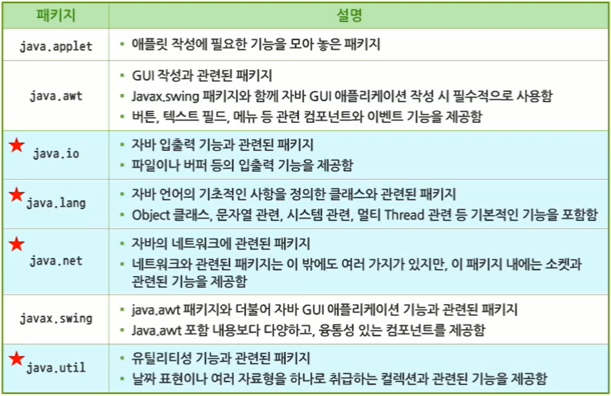

# 인터페이스와 패키지

Commit 여부: No

# 11. 인터페이스와 패키지

## 11.1 인터페이스와 다형성

### 11.1.1 인터페이스

- 인터페이스
    - 추상 클래스보다 추상성이 더욱 심화된 개념
    - 멤버 변수는 상수형으로 선언되어야 함
    - 메서드는 모두 추상 메서드로 선언되어야 함
    - 상수와 추상 메서드 외에 다른 멤버를 갖지 못하게 함으로써 추상 클래스보다 더욱 완벽한 추상화를 제공
    - 상속 관계가 아니거나 다중 상속을 받고 싶은 경우 활용 가능
    - 인터페이스는 변수를 가질 수 없는 특수한 클래스이므로 다중상속이 가능하게 됨
- 인터페이스 정의 방법
    - 구문
      
        ```java
        public interface 인터페이스명 [extends 부모인터페이스명] {
        	// 상수(final 예약어 사용)
        	// 추상 메서드
        }
        ```
        
    - 인터페이스의 변수 선언에 사용된 `static final` 이나 메서드 선언에 사용된 `abstract`는 생략 가능
- 인터페이스 예제
  
    ```java
    package sec01;
    
    public interface Drawable {
    	
    	public int PLAIN_PEN = 1;
    	public int BOLD_PEN = 2;
    	public int ITALIC_PEN = 3;
    	
    	public void draw();
    	public void move(int x, int y);
    
    }
    ```
    

### 11.1.2 인터페이스의 활용

- 인터페이스 활용
    - 추상 클래스와 유사하게 직접 객체화 되지 못함
    - 인터페이스의 상속을 통해 자식 클래스를 생성하는데 `implements` 예약어 사용
    - 구문
      
        ```java
        [modifiers] class 클래스명 [extends 부모 클래스] [implements 인터페이스1, 인터페이스2, ...] {
        	...
        }
        ```
        
    - 인터페이스를 상속하는 클래스는 인터페이스에 정의된 추상 메서드들을 overriding 해야 함
- 인터페이스 활용 예제
  
    ```java
    package sec01;
    
    class Shape {
    
    	int x = 0;
    	int y = 0;
    
    	Shape(int x, int y) {
    		this.x = x;
    		this.y = y;
    	}
    
    }
    ```
    
    ```java
    package sec01;
    
    class Circle extends Shape implements Drawable {
    
    	int radius;
    
    	Circle(int x, int y, int radius) {
    
    		super(x, y);
    		this.radius = radius;
    
    	}
    
    	public void draw() {
    		System.out.println("(" + x + ", " + y + ") radius = " + radius);
    	}
    
    	public void move(int x, int y) {
    		System.out.println("(" + (this.x + x) + ", " + (this.y + y) + ") radius = " + radius);
    	}
    
    }
    ```
    
    ```java
    package sec01;
    
    class Rectangle extends Shape implements Drawable {
    
    	int width;
    	int height;
    
    	Rectangle(int x, int y, int width, int height) {
    
    		super(x, y);
    		this.width = width;
    		this.height = height;
    
    	}
    
    	public void draw() {
    
    		System.out.println("(" + x + ", " + y + ") width = " + width + ", height = " + height);
    
    	}
    
    	public void move(int x, int y) {
    
    		System.out.println("(" + (this.x + x) + ", " + (this.y + y) + ") width = " + width + ", height = " + height);
    
    	}
    
    }
    ```
    
    ```java
    package sec01;
    
    public class InterfaceTest1 {
    
    	public static void main(String[] args) {
    		// TODO Auto-generated method stub
    
    		Circle c = new Circle(10, 10, 100);
    		c.draw();
    		c.move(5, 5);
    
    		Rectangle r = new Rectangle(20, 20, 50, 50);
    		r.draw();
    		r.move(5, 10);
    
    	}
    
    }
    ```
    
    - 결과
      
        ```java
        (10, 10) radius = 100
        (15, 15) radius = 100
        (20, 20) width = 50, height = 50
        (25, 30) width = 50, height = 50
        ```
    
- 형변환
    - 인터페이스 사용 시 클래스와 동일하게 묵시적 형변환과 명시적 형변환 사용 가능
- 인터페이스의 상속
    - 인터페이스 선언 시 다른 인터페이스를 상속하여 정의할 수 있음
    - 인터페이스를 상속하는 경우에도 `extends` 예약어를 사용함
    - 인터페이스도 상속 관계에 따라 계층 구조를 가질 수 있음
- 인터페이스 계층 구조 예제
  
    ```java
    package sec01;
    
    interface Paintable {
    	
    	public void paint();
    
    }
    ```
    
    ```java
    package sec01;
    
    interface Printable extends Paintable, Drawable {
    	
    	public void print();
    
    }
    ```
    
- 인터페이스 상속 테스트 예제
  
    ```java
    package sec01;
    
    class Circle2 implements Printable {
    
    	public void draw() {
    		System.out.println("원 그리기");
    	}
    
    	public void move(int x, int y) {
    		System.out.println("원 이동 : (" + x + ", " + y + ")");
    	}
    
    	public void paint() {
    		System.out.println("원 색칠");
    	}
    
    	public void print() {
    		System.out.println("원 출력");
    	}
    
    }
    ```
    
    ```java
    package sec01;
    
    public class Test {
    
    	public static void main(String[] args) {
    		// TODO Auto-generated method stub
    
    		Circle2 c = new Circle2();
    
    		c.draw();
    		c.move(5, 5);
    		c.paint();
    		c.print();
    
    	}
    
    }
    ```
    
    - 결과
      
        ```java
        원 그리기
        원 이동 : (5, 5)
        원 색칠
        원 출력
        ```
        

## 11.2 객체지향 언어의 주요 개념

### 11.2.1 패키지 개요

- 패키지
    - 자바의 클래스들을 분류하고, 관련된 클래스와 인터페이스를 하나의 폴더에 적절하게 배치할 때 관련된 클래스들이 묶어 있는 폴더
    - 다른 기능을 구현한 같은 이름의 클래스를 사용할 때 이름의 충돌을 피할 수 있음
    - 관리가 용이하며, 클래스의 접근 권한을 패키지 단위로 제어할 수 있음
    - 자바는 API에 제공되는 많은 클래스들을 패키지화하여 제공
    - 사용자가 만든 클래스들을 패키지화해서 사용할 수도 있음
- 자바 API 패키지
  
    
    
- `import` 예약어
    - API에 제공되는 패키지화된 클래스들을 사용하기 위해 `import` 예약어 사용
    - 별도의 패키지를 지정하지 않은 경우 디폴트 패키지가 됨
    - 디폴트 패키지의 클래스를 사용할 때는 `import` 문을 사용하지 않음
    - java.lang 패키지는 별도의 `import` 문을 사용하지 않음
    - `import` 문을 사용하여 JVM 실행 시 클래스를 찾게 되는 과정 : 클래스가 저장된 폴더 → 클래스패스를 설정한 폴더 → `import`한 클래스
    - 다양한 패키지에서 동일한 이름의 클래스를 `import` 하면 에러 발생
      
        ⇒ 사용빈도가 높은 클래스가 포함된 패키지를 `import` 시키고, 사용빈도가 낮은 클래스는 패키지 경로를 포함하여 사용
    
- `import` 문 사용 시 패키지 이름 지정 방법
    1. 패키지의 특정 클래스 이름까지 포함된 완전한 이름을 사용하는 경우 : 패키지 내의 한 클래스만 사용하는 경우
    2. 패키지의 이름만 사용하는 경우 : 한 패키지 내에 여러 클래스가 사용될 때 패키지 이름만 사용
    - `import` 문 사용 시 패키지 이름 지정 방법은 컴파일러에게 포함할 클래스를 미리 알려주는 것
      
        ⇒ 컴파일 시간의 효율성과 연관
    
- `import` 문 예제
    1. 예제 1
       
        ```java
        package sec02;
        
        import java.util.*;
        
        public class ImportTest {
        
        	public static void main(String[] args) {
        		// TODO Auto-generated method stub
        
        		Date date = new Date();
        
        		System.out.println(date.toString());
        
        	}
        
        }
        ```
        
    2. 예제 2
       
        ```java
        package sec02;
        
        import java.sql.Date;
        
        public class ImportTest2 {
        
        	public static void main(String args[]) {
        
        		java.util.Date utilDate = new java.util.Date();
        		System.out.println("util Date : " + utilDate.toString());
        
        		Date sqlDate = new Date(System.currentTimeMillis());
        		System.out.println("sql Date : " + sqlDate.toString());
        
        	}
        
        }
        ```
        
        - 결과
          
            ```java
            util Date : Sun Jan 09 22:02:18 KST 2022
            sql Date : 2022-01-09
            ```
            

### 11.2.2 사용자 정의 패키지

- `package` 예약어
    - 개발자가 작성한 클래스를 특정 패키지로 묶을 수 있음
    - 패키지 선언 문장은 반드시 첫 번째 문장으로 기술해야 함
    - `.`을 이용하여 복잡한 구조의 패키지 생성 가능
- 사용자 정의 패키지와 `import`
    - 사용자 정의 패키지로 특정 클래스를 정의한 경우에도 `import` 예약어를 사용해야만 해당 클래스를 사용할 수 있음

### 11.2.3 커스텀 라이브러리 사용

- 커스텀 라이브러리 생성하기
    - 자바는 프로그램 구현에 필요한 중요한 클래스들을 API 형태로 JVM에 포함
    - API에서 제공하지 않거나 API를 응용해서 개발자가 직접 만든 클래스들을 라이브러리 형태로 만들어서 사용하는 것이 커스텀 라이브러리
- 커스텀 라이브러리 생성 과정
    1. 클래스 작성
    2. 프로젝트 선택
    3. 우클릭 한 후 [Export] 선택
    4. [JAR file] 선택
    5. .classpath와 .project 체크 해제
    6. JAR file 이름과 이 파일에 생성될 위치 설정
- 커스텀 라이브러리 사용 과정
    1. 프로젝트 생성
    2. 패키지와 클래스 생성
    3. 프로젝트 선택한 후 우클릭하여 [Build Path] - [Configure Build Path...] 선택
    4. [Libraries] - [Add External JARs] 선택
    5. JAR 파일 선택 후 열기

---