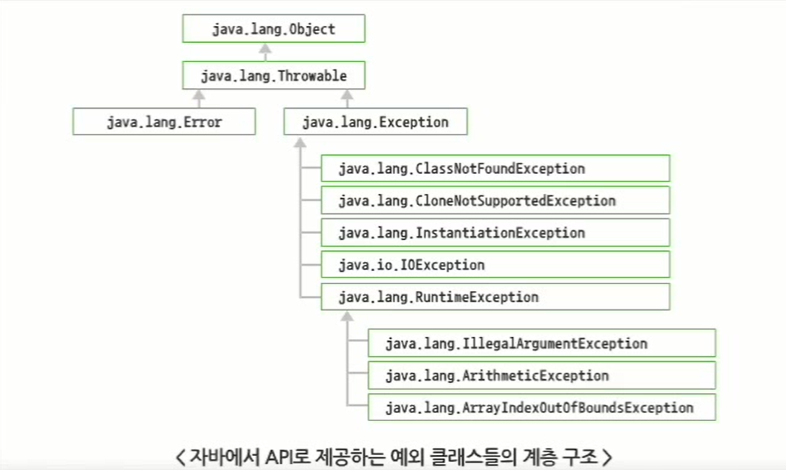

# 12. 예외처리

## 12.1 예외 처리

### 12.1.1 예외의 개념

- 오류
    1. 에러
        - 프로그램으로 처리할 수 없기 때문에 에러 발생 시 프로그램이 중단됨
    2. 예외
        - 프로그램 실행 중에 발생할 수 있는 가벼운 사건
        - 프로그래머가 충분히 예측할 수 있는 사건
        - 프로그램적으로 얼마든지 처리할 수 있는 오류
- 예외가 발생하는 경우
    - 정수를 0으로 나누는 경우
    - 배열의 인덱스가 음수 값을 가지는 경우
    - 배열의 인덱스가 배열의 길이를 넘어서는 경우
    - 부적절한 형변환이 발생하는 경우
    - 입출력 시 인터럽트(Interrupt)가 발생하는 경우
    - 입출력을 위해 필요한 파일이 존재하지 않는 경우
- 예외 처리 과정
    - 자바는 객체지향 언어이므로 예외도 객체로 처리
      
        ⇒ 예외를 객체로 처리하기 위해 객체를 생성할 클래스가 필요함
        
    - 발생 가능성이 있는 모든 예외 상황을 미리 예측하여 다양한 예외 클래스를 제공함
    - 자바 가상 머신(JVM)이 던진(throw) 예외 객체를 받아서(catch) 예외 처리 로직을 수행하고 프로그램을 계속 진행함
    - 예외 처리 로직을 구현하지 않을 경우 기본 예외 처리 핸들러가 에러 메시지를 화면에 출력하고 실행을 중지시킴
- 예외 클래스
    - 예외 객체를 생성하기 위한 다양한 예외 클래스가 존재
    - 예외 클래스는 이름만으로 어떤 의미의 예외인지 알 수 있도록 작성됨
        - ArithmeticException : 정수를 0으로 나누는 경우
        - IndexOutOfBoundsException : 배열의 인덱스가 배열의 길이를 넘어서는 오류
        - IllegalArgumentException : 메서드의 매개변수 유형을 잘못 사용하는 경우
        - IOException : 입출력 시에 지정한 파일이 시스템에 존재하지 않는 경우
    - 모든 예외는 java.lang.Throwable 클래스의 자식 클래스인 java.lang.Exception 클래스의 자식 클래스로 만들어짐
      
        
        
        - RuntimeException의 자식 클래스는 예외 처리 로직이 없어도 컴파일 가능
        - RuntimeException의 자식 클래스가 아닌 예외 클래스는 예외 처리 로직이 없으면 컴파일이 안됨
- 예외 클래스 예제
  
    ```java
    package sec01;
    
    public class NotRuntimeExceptionTest {
    	
    	public static void main(String[] args) {
    		
    		int data = System.in.read();
    		System.out.println((char)data);
    	}
    
    }
    ```
    

### 12.1.2 예외 처리

- 예외 처리
    - 자바 언어를 더욱 강하게 만든 요인
    - 처리 방법
        1. 예외가 발생한 메서드 내에서 직접 처리 : `try-catch`, 다중 `catch`, 상속, `finally` 블록
        2. 해당 메서드를 호출한 곳으로 예외 처리를 넘기는 방식 : `throws` 예약어
- `try-catch` 구문
    - 예외가 발생한 메서드 내에서 직접 처리하는 방법 중 하나
    - 구문
      
        ```java
        try{
        	예외 발생 가능이 있는 소스코트;
        } catch(예외 타입 매개변수명){
        	예외타입의 예외가 발생할 경우 수행될 소스코드;
        }
        ```
        
    - `try` 블록
        - 프로그래머가 프로그램 중에서 예외가 발생할 수 있는 소스코드들을 `try` 블록 안에 작성
        - `try` 블록은 최소한 하나의 `catch` 블록이 있어야 함
    - `catch` 블록
        - `try` 블록 다음에 위치
        - `catch` 블록의 매개변수는 예외 객체가 발생했을 때 참조하는 변수명
        - 반드시 java.lang.Throwable 클래스의 하위 클래스 타입으로 선언되어야 함
    - 수행 과정
      
        지정한 타입의 예외 객체 발생 → `try` 블록의 나머지 문장 수행하지 않음 → JVM은 발생한 예외 객체를 발생 → 발생한 예외 객체 타입에 해당하는 `catch` 블록을 수행
    
- `try-catch` 예제
  
    ```java
    package sec01;
    
    public class ExceptionTest {
    
    	public static void main(String[] args) {
    		// TODO Auto-generated method stub
    
    		System.out.println("program start...");
    
    		try {
    
    			int num1 = 9;
    			int num2 = 0;
    
    			System.out.println("나누기 결과 : " + (num1 / num2));
    
    		} catch (Exception e) {
    			// TODO: handle exception
    
    			System.out.println("정수를 0으로 나눌 수 없습니다.");
    
    		}
    
    		System.out.println("program end...");
    
    	}
    
    }
    ```
    
    - 결과
      
        ```java
        program start...
        정수를 0으로 나눌 수 없습니다.
        program end...
        ```
    
- 다중 `catch` 블록
    - 프로그램에서 발생하는 예외에 따라서 적절하게 예외 처리를 분기시켜야 함
    - 여러 개의 예외 처리
    - 구문
      
        ```java
        try {
         예외 발생 가능이 있는 소스코드;
        } catch(예외 타입1 매개변수명) {
         예외타입 1의 예외가 발생할 경우 수행될 소스코드;
        } catch(예외 타입n 매개변수명){
        	예외타입n의 예외가 발생할 경우 수행될 소스코드;
        }
        ```
    
- 다중 `catch` 예제
  
    ```java
    package sec01;
    
    public class ExceptionHandlerTest {
    
    	public static void main(String[] args) {
    		// TODO Auto-generated method stub
    
    		System.out.println("program start...");
    
    		try {
    
    			int num1 = Integer.parseInt(args[0]);
    			int num2 = Integer.parseInt(args[1]);
    
    			System.out.println("나누기 결과 : " + (num1 / num2));
    
    		} catch (ArithmeticException e) {
    			System.out.println("정수를 0으로 나눌 수 없다.");
    		} catch (ArrayIndexOutOfBoundsException e) {
    			System.out.println("명령행 매개변수 2개가 필요하다.");
    		}
    
    		System.out.println("program end...");
    
    	}
    
    }
    ```
    
    - 결과
      
        ```java
        program start...
        명령행 매개변수 2개가 필요하다.
        program end...
        ```
    
- 상속을 이용한 예외 처리
    - 자바에서 지원하는 모든 예외 클래스는 Exception 클래스의 자식 클래스로 존재
    - Exception 객체는 형변환에 의해 Exception 타입의 변수로 할당
    - 구체적으로 어떤 예외가 발생했는지를 알 수 없음
    - 발생된 예외 객체에 따라서 예외 처리 로직을 분기 처리할 수 없음
    - Exception 타입의 catch 블록은 다중 catch 구문에서 맨 마지막에 위치해야 함
- `finally` 블록
    - `try-catch` 블록 지정 시 `try` 블록과 함께 사용 가능
    - `finally` 블록 내용은 예외 발생 유무나 예외 `catch` 유무와 상관 없이 무조건 수행
    - DB 연동 로직, 파일 입출력 로직을 수행한 후 반드시 수행되어야 할 로직이 있는 경우에 사용
    - 구문
      
        ```java
        try {
        
        } catch(예외 타입 매개변수명) {
        
        } finally {
        	예외 발생 여부와 상관없이 수행되는 코드;
        }
        ```
    
- `throws` 예약어
    - 예외가 발생한 메서드를 호출한 지점으로 예외를 전달하여 처리
    - 구문
      
        ```java
        [modifiers] returnType 메서드명(매개변수) [throws Excepton1, Exception2, ...] {
        
        }
        ```
    
- `throws` 예제
  
    ```java
    package sec01;
    
    public class ThrowsTest {
    
    	public static void main(String[] args) {
    		// TODO Auto-generated method stub
    
    		System.out.println("program start... ");
    
    		int[] scoreList = { 45, 77, 59, 88, 100 };
    
    		try {
    
    			double avgScore = getAvgScore(scoreList);
    			System.out.println("평균 점수 : " + avgScore);
    
    		} catch (ArrayIndexOutOfBoundsException e) {
    			// TODO: handle exception
    
    			System.out.println("평균 구할 때 문제 발생");
    
    		}
    
    		System.out.println("program end...");
    
    	}
    
    	public static double getAvgScore(int[] scoreList) throws ArrayIndexOutOfBoundsException {
    
    		int sum = 0;
    
    		for (int i = 0; i <= scoreList.length; i++) {
    
    			sum = sum + scoreList[i];
    
    		}
    
    		return (double) sum / scoreList.length;
    
    	}
    
    }
    ```
    

## 12.2 사용자 정의 예외

### 12.2.1 사용자 정의 예외 처리

- 사용자 예외 클래스의 정의
    - 개발자가 직접 예외 클래스를 정의해서 사용
    - java.lang.Exception 클래스를 상속받아 정의
    - 구문
      
        ```java
        class 예외 클래스명 extends Exception
        ```
    
- 사용자 예외 클래스 예제
  
    ```java
    package sec02;
    
    class Account {
    
    	String name;
    	int currentMoney;
    
    	public Account(String name, int currentMoney) {
    		this.name = name;
    		this.currentMoney = currentMoney;
    	}
    
    	public void withdraw(int money) {
    		currentMoney = currentMoney - money;
    	}
    
    	public String toString() {
    		// TODO Auto-generated method stub
    		return "Account [name=" + name + ", currentMoney=" + currentMoney + "]";
    	}
    }
    ```
    
    ```java
    package sec02;
    
    public class CustomExceptionTest {
    
    	public static void main(String[] args) {
    		// TODO Auto-generated method stub
    		
    		Account kimAccount = new Account("김철수", 100);
    		kimAccount.withdraw(150);
    		
    		System.out.println(kimAccount.toString());
    
    	}
    
    }
    ```
    
    - 결과
      
        ```java
        Account [name=김철수, currentMoney=-50]
        ```
        

---