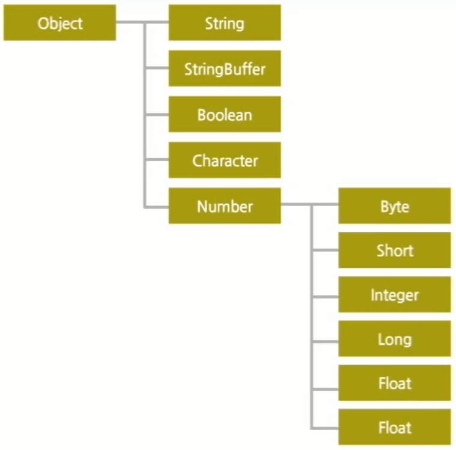
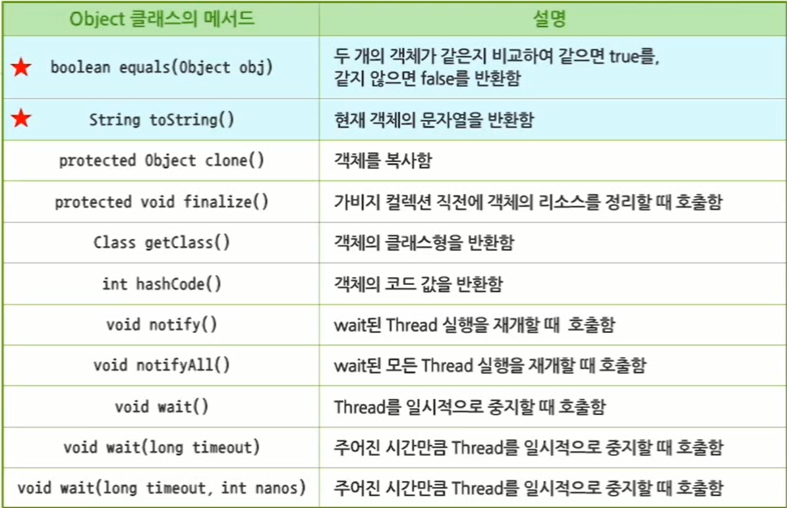
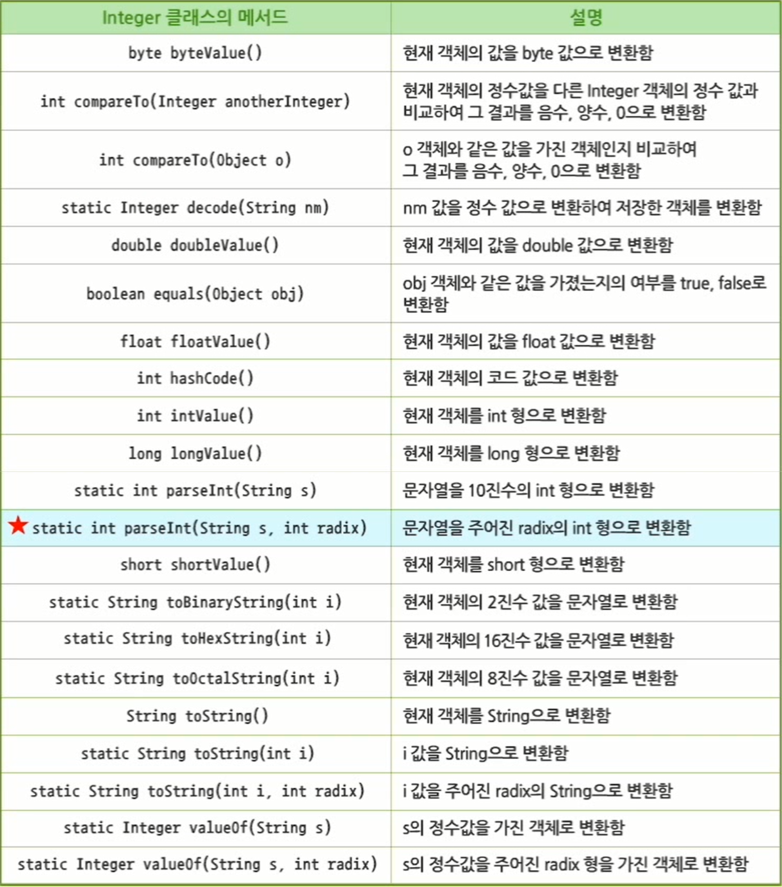
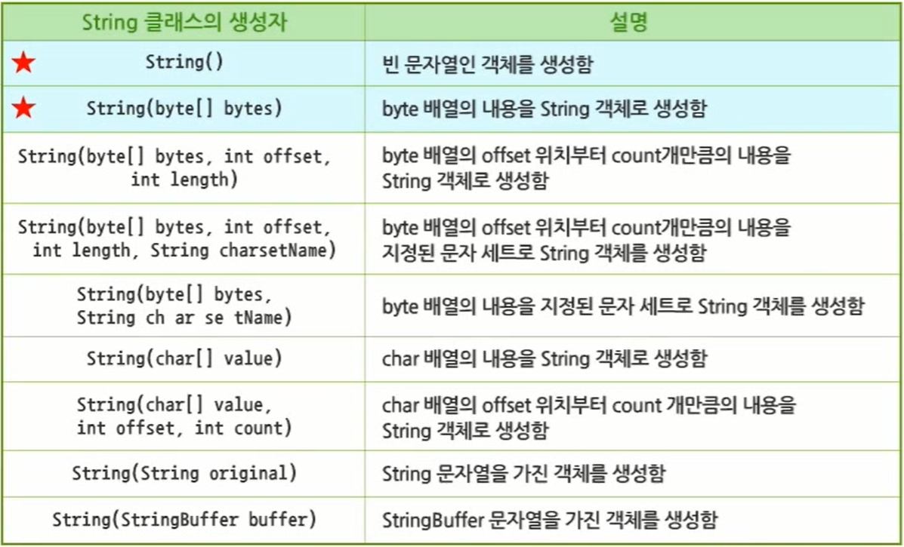
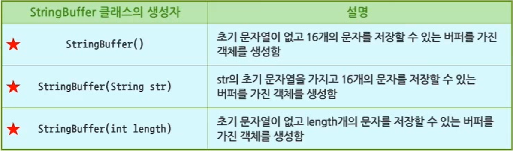
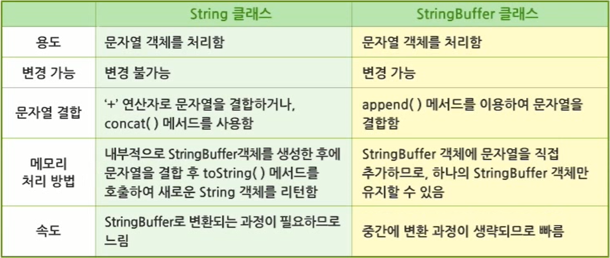

# 13. java.lang 패키지

## 13.1 java.lang 패키지

### 13.1.1 java.lang 패키지

- java.lang 패키지
    - 가장 기본이 되는 필수 클래스들과 인터페이스들이 포함된 패키지
    - java.lang 패키지의 클래스나 인터페이스들을 `import` 구문 없이 사용할 수 있도록 함
    - java.lang 패키지의 계층 구조
      
        
        
        - Object : java.lang 패키지 내의 최상위 클래스
        - String : 변하지 않는 문자열을 다룰 때 사용
        - StringBuffer : 내용이 계속 변하는 문자열을 다룰 때 사용
        - 자바의 기본 데이터 타입 8가지에 대응하는 Wrapper 클래스들이 있음
          
            ⇒ 기본 데이터 타입의 각종 변환에 사용
            

### 13.1.2 Object 클래스

- java.lang.object 클래스
    - 자바 API의 모든 클래스와 사용자가 정의한 모든 클래스의 상위 클래스
    - 모든 자바 클래스들은 Object 클래스로부터 상속받는다는 의미
    - Object 클래스의 상속은 소스 상에 명시하지 않아도 자동으로 구현
    - Object 클래스는 클래스 정의 시 클래스 선언부에 명시적으로 지정하지 않아도 자동으로 상속받게 됨
      
        ⇒ 자바의 모든 클래스는 부모인 Object 클래스의 모든 변수와 메서드를 상속받아 사용 가능
    
- 주요 메서드
  
    
    
- `==` 연산자
    - 값을 비교하기 위해서 사용하는 연산자
    - 구분
        1. 기본형 변수
            - 변수가 값 자체를 가지기 때문에 값을 비교할 수 있음
            - 예시
              
                ```java
                int a = 10;
                int b = 10;
                
                System.out.println(a == b); // true 출력
                ```
            
        2. 참조형 변수
            - 메모리의 다른 위치에 생성된 객체의 주소 값이 객체 참조 변수에 저장됨
            - 객체의 내용을 비교하는 것이 아니라 주소 값이 같은지 여부를 비교함
            - 예시
              
                ```java
                Car car1 = new Car("Red", 220);
                Car car2 = new Car("Red", 220);
                
                System.out.println(car1 == car2); // 생성된 값들이 동일하더라도 참조하는 주소 값이 다르기 때문에 false 출력
                ```
    
- `equals()` 메서드
    - 비교 대상이 되는 두 개의 주소 값을 비교하는 것이 아니라 객체의 내용을 비교할 때 사용
    - Object 클래스를 상속한 모든 자식 클래스에서 `equals()` 메서드를 overriding 하지 않으면 object로부터 상속된 메서드를 사용
    - 특정 클래스로부터 생성된 객체들의 내용을 비교하는 로직을 개발하기 위해서는 모든 클래스에 `equals()` 메서드를 적절하게 overriding 해야 함
- `equals()` 메서드 예제
  
    ```java
    package sec01;
    
    public class Car {
    
    	String name;
    	int speed;
    
    	public Car(String name, int speed) {
    		this.name = name;
    		this.speed = speed;
    	}
    
    	public boolean equals(Object obj) {
    		Car other = (Car) obj;
    
    		if (name != other.name)
    			return false;
    
    		if (speed != other.speed)
    			return false;
    
    		return true;
    	}
    
    }
    ```
    
    ```java
    package sec01;
    
    public class Test {
    
    	public static void main(String[] args) {
    		// TODO Auto-generated method stub
    
    		Car car1 = new Car("Red", 220);
    		Car car2 = new Car("Red", 220);
    
    		if (car1 == car2)
    			System.out.println("car1, car2는 주소 값이 같다");
    		if (car1.equals(car2))
    			System.out.println("car1, car2는 객체의 내용이 같다");
    
    	}
    
    }
    ```
    
    - 결과
      
        ```java
        car1, car2는 객체의 내용이 같다
        ```
    
- `toString()` 메서드
    - 수시로 변하는 객체의 변수 값들을 화면에 간단하게 출력하고자 할 때 사용
    - 객체의 클래스 타입 이름과 객체의 코드 값을 16진수 문자열로 리턴하도록 구현함
    - Object 클래스로부터 상속받은 메서드를 그대로 사용하면 의도했던 객체의 상태 확인이 불가능함
      
        ⇒ `toString()` 메서드는 Object를 상속한 자식 클래스에서 적절하게 overriding하여 사용해야 함
        
    - `System.out.println()` 메서드 호출 시 자동으로 호출되기 때문에 생략 가능
- `toString()` 메서드 예제
  
    ```java
    package sec01;
    
    public class Car2 {
    
    	String name;
    	int speed;
    
    	public Car2(String name, int speed) {
    		this.name = name;
    		this.speed = speed;
    	}
    
    	@Override
    	public String toString() {
    		// TODO Auto-generated method stub
    		return "Car2 객체의 정보 : name=" + name + ", speed=" + speed;
    	}
    
    }
    ```
    
    ```java
    package sec01;
    
    public class Test2 {
    
    	public static void main(String[] args) {
    		// TODO Auto-generated method stub
    
    		Car2 car = new Car2("Red", 220);
    
    		System.out.println(car.toString());
    		System.out.println(car);
    
    	}
    
    }
    ```
    
    - 결과
      
        ```java
        Car2 객체의 정보 : name=Red, speed=220
        Car2 객체의 정보 : name=Red, speed=220
        ```
    
- `equals()` 자동 생성 과정
    1. private로 접근 제한된 변수들을 가진 클래스 정의
       
        ```java
        package sec01;
        
        public class Employee {
        
        	private String name;
        	private int number;
        	private int age;
        	private String title;
        	private String dept;
        	private String grade;
        
        }
        ```
        
    2. [우클릭] - [Sources] - [Generate hashCode() and equals()...] 선택
    3. 변수를 선택한 후 확인 버튼을 눌러 메서드 생성
    4. `hashCode()` 메서드 제거
       
        ```java
        package sec01;
        
        import java.util.Objects;
        
        public class Employee {
        
        	private String name;
        	private int number;
        	private int age;
        	private String title;
        	private String dept;
        	private String grade;
        
        	@Override
        	public boolean equals(Object obj) {
        		if (this == obj)
        			return true;
        		if (obj == null)
        			return false;
        		if (getClass() != obj.getClass())
        			return false;
        		Employee other = (Employee) obj;
        		return age == other.age && Objects.equals(dept, other.dept) && Objects.equals(grade, other.grade)
        				&& Objects.equals(name, other.name) && number == other.number && Objects.equals(title, other.title);
        	}
        
        }
        ```
    
- `toString()` 자동 생성 과정
    1. private로 접근 제한된 변수들을 가진 클래스 정의
       
        ```java
        package sec01;
        
        public class Employee {
        
        	private String name;
        	private int number;
        	private int age;
        	private String title;
        	private String dept;
        	private String grade;
        
        }
        ```
        
        1. [우클릭] - [Sources] - [Generate toString()...] 선택
        2. 변수를 선택한 후 확인 버튼을 눌러 메서드 생성
           
            ```java
            package sec01;
            
            import java.util.Objects;
            
            public class Employee {
            
            	private String name;
            	private int number;
            	private int age;
            	private String title;
            	private String dept;
            	private String grade;
            
            	@Override
            	public String toString() {
            		return "Employee [name=" + name + ", number=" + number + ", age=" + age + ", title=" + title + ", dept=" + dept
            				+ ", grade=" + grade + "]";
            	}
            
            }
            ```
            

### 13.1.3 Wrapper 클래스

- Wrapper 클래스
    - 자바에서는 8가지 기본 데이터 타입을 객체로 사용할 수 있도록 지원
      
        ⇒ 기본 데이터 타입에 해당하는 클래스가 제공된다는 의미
        
    - Wrapper 클래스는 기본 데이터 타입에 따른 객체를 지원하기 위해 각각의 데이터 타입과 관련된 클래스
    - 사용자의 문자열 입력을 다양한 기본 데이터 타입으로 변환하는 편리한 메서드들을 제공함
    - Wrapper 클래스 객체는 한 번 생성되면 값이 변할 수 없음
    - 연관 관계
      
        
    
- Interger 클래스의 메서드
  
    
    
- Wrapper 클래스 메서드 예제
  
    ```java
    package sec01;
    
    public class WrapperTest {
    
    	public static void main(String[] args) {
    		// TODO Auto-generated method stub
    
    		Boolean b1 = new Boolean("TRUE"); // 대소문자를 구분하지 않고 true라는 매개변수를 모두 true라고 취급
    		Boolean b2 = new Boolean("????"); // true 외 문자열은 모두 false
    
    		Integer i1 = new Integer(10); // 정수 클래스
    		Integer i2 = new Integer(10);
    
    		Double d = new Double(10.0); // 실수 클래스
    
    		System.out.println("Boolean 객체 : " + b1); // 생성한 각 객체들을 출력하여 값 확인
    		System.out.println("Boolean 객체 : " + b2);
    		System.out.println("Integer 객체 : " + i1);
    		System.out.println("double 객체 : " + d);
    
    		System.out.println("int의 최대값 : " + Integer.MAX_VALUE);
    		System.out.println("int의 최소값 : " + Integer.MIN_VALUE);
    
    		if (i1.equals(i2))
    			System.out.println("같다");
    
    		System.out.println("a 문자가 대문자인가 : " + Character.isUpperCase('a'));
    		System.out.println("-1의 이진수 : " + Integer.toBinaryString(-1));
    		System.out.println("String 3.14를 실수로 변환 : " + Double.parseDouble("3.14"));
    
    	}
    
    }
    ```
    
    - 결과
      
        ```java
        Boolean 객체 : true
        Boolean 객체 : false
        Integer 객체 : 10
        double 객체 : 10.0
        int의 최대값 : 2147483647
        int의 최소값 : -2147483648
        같다
        a 문자가 대문자인가 : false
        -1의 이진수 : 11111111111111111111111111111111
        String 3.14를 실수로 변환 : 3.14
        ```
        

## 13.2 객체지향 언어의 주요 개념

### 13.2.1 String 클래스

- String 클래스
    - String 객체는 여러 개의 문자들로 이루어진 문자 배열 형태로 생성하고 인덱스는 0부터 시작
    - 문자열 객체를 생성하고 처리하기 위해 사용하는 클래스
- 주요 생성자
  
    
    
- 주요 메서드
  
    
    
- String 클래스 특징
    - String 객체는 한 번 생성되면 문자열 내용이 변경되지 않음
    - String 클래스가 제공하는 모든 메서드는 메서드 실행 결과를 또 다른 문자열 객체로 리턴함
    - 프로그램에서 변하지 않은 문자열을 표현할 때 많이 사용
    - String 클래스는 두 가지 형태의 객체 생성 방법을 제공
      
        ```java
        String name1 = new String("문자열");
        String name2 = "문자열";
        ```
        
    - 변수에 값을 할당하는 방법으로 객체 생성 가능
    - `new` 연산자를 사용하지 않고 문자열을 저장한 변수는 컴파일 시점에 생성되어 메모리를 할당 받음
    - 동일한 문자열을 가진 String이라면 같은 문자열이 저장된 주소 값을 재사용함
    - 문자열과 `+` 연산자를 결합하여 사용할 경우 문자열 결합의 의미로 사용함
    - `+`를 기준으로 옆에 String 타입의 데이터가 오면 나머지 한쪽도 String 타입으로 변환되어 두 개의 문자열을 결합함
    - String 클래스는 문자열이 사용될 때마다 문자의 길이를 다시 계산할 필요가 없기 때문에 편리함
- String 클래스 예제
    1. 예제 1
       
        ```java
        package sec02;
        
        public class StringTest1 {
        
        	public static void main(String[] args) {
        		// TODO Auto-generated method stub
        
        		String companyName1 = new String("자바"); // "자바" 문자열 객체 생성
        		String companyName2 = companyName1.concat("마트"); // companyName1 문자열 뒤에 "마트" 결합
        
        		System.out.println(companyName1);
        		System.out.println(companyName2);
        
        	}
        
        }
        ```
        
        - 결과
          
            ```java
            자바
            자바마트
            ```
        
    2. 예제 2
       
        ```java
        package sec02;
        
        public class StringTest2 {
        
        	public static void main(String[] args) {
        		// TODO Auto-generated method stub
        
        		char[] charArr = { 'J', 'a', 'v', 'a' };
        		byte[] byteArr = { 65, 66, 67, 68, 69 };
        
        		String str1 = new String(charArr);
        		String str2 = new String(charArr, 0, 2);
        		String str3 = new String("Program");
        		String str4 = new String(byteArr);
        
        		System.out.println(str1);
        		System.out.println(str2);
        		System.out.println(str3);
        		System.out.println(str4);
        
        	}
        
        }
        ```
        
        - 결과
          
            ```java
            Java
            Ja
            Program
            ABCDE
            ```
        
    3. 예제 3
       
        ```java
        package sec02;
        
        public class StringTest3 {
        
        	public static void main(String[] args) {
        		// TODO Auto-generated method stub
        
        		String compName = "Java JDJ"; // String 객체 생성
        
        		System.out.println(compName.concat(" Program")); // compName 문자열에 " Program" 문자열 결합
        
        		System.out.println(compName.toLowerCase()); // 모두 소문자로
        		System.out.println(compName.toUpperCase()); // 모두 대문자로
        
        		System.out.println(compName.length()); // 문자열의 길이
        
        		System.out.println(compName.startsWith("Ja")); // "Ja"로 시작하는지 확인
        		System.out.println(compName.endsWith("va")); // "va"로 끝나는지 확인
        
        		System.out.println(compName.equals("Java jdj")); // 문자열 내용이 "Java jdj"와 동일한지 확인
        		System.out.println(compName.equalsIgnoreCase("java jdj")); // 문자열의 내용이 "java jdj"와 대소문자 상관없이 동일한지
        
        		System.out.println(compName.charAt(0)); // 문자열의 0번 인덱스 문자 확인
        		System.out.println(compName.charAt(compName.length() - 1)); // 문자열의 마지막 문자 확인
        		System.out.println(compName.indexOf("JDJ")); // "JDJ" 문자열의 인덱스 위치 확인
        		System.out.println(compName.lastIndexOf("va")); // 뒤에서부터 검색을 진행하여 "va" 문자열의 인덱스 위치 확인
        
        		System.out.println(compName.substring(0, 7)); // 문자열 0번부터 6번까지 문자열을 잘라냄
        		System.out.println(compName.substring(5)); // 5번 인덱스부터 끝까지 잘라냄
        
        		System.out.println(compName.replace('J', 'j'));
        
        	}
        
        }
        ```
        
        - 결과
          
            ```java
            Java JDJ Program
            java jdj
            JAVA JDJ
            8
            true
            false
            false
            true
            J
            J
            5
            2
            Java JD
            JDJ
            java jDj
            ```
            

### 13.2.2 StringBuffer 클래스

- StringBuffer 클래스
    - 자바 프로그램 내에서 변하는 문자열을 다룰 때 사용
    - 객체 크기가 동적임
    - 객체 생성 시 크기를 지정하지 않아도 기본적으로 16개의 문자를 저장할 수 있는 버퍼 공간을 가짐
    - 객체를 한 번 생성한 후에도 계속하여 문자열의 내용을 변경할 수 있음
    - 메서드는 문자열 처리 후의 결과를 원래 객체에 반영
    - 메서드 리턴 타입은 `void`
- 주요 생성자
  
    
    
- 주요 메서드
  
    
    
- `concat()` 메서드와 `append()` 메서드 비교 예제
  
    ```java
    package sec02;
    
    public class StringBufferTest1 {
    
    	public static void main(String[] args) {
    		// TODO Auto-generated method stub
    
    		String str = "회사명 : ";
    
    		str.concat("자바전자");
    
    		System.out.println(str);
    
    		StringBuffer strbuff = new StringBuffer("회사명 : ");
    
    		strbuff.append("자바전자");
    
    		System.out.println(strbuff);
    
    	}
    
    }
    ```
    
    - 결과
      
        ```java
        회사명 : 
        회사명 : 자바전자
        ```
    
- StringBuffer 클래스 사용
    - `+` 연산자를 사용하여 결합 불가
    - `new` 연산자 없이 객체 생성 불가
- StringBuffer 문자열 결합 예제
  
    ```java
    package sec02;
    
    public class StringBufferTest2 {
    
    	public static void main(String[] args) {
    		// TODO Auto-generated method stub
    
    		StringBuffer str = new StringBuffer("java");
    
    		System.out.println("Capacity : " + str.capacity());
    		System.out.println("Length : " + str.length());
    
    		str.append(" language");
    
    		System.out.println("문자열 결합 후 Capacity : " + str.capacity());
    		System.out.println("문자열 결합 후 Length : " + str.length());
    
    		System.out.println(str.toString());
    
    		str.insert(5, "program ");
    
    		System.out.println(str.toString());
    
    	}
    
    }
    ```
    
    - 결과
      
        ```java
        Capacity : 20
        Length : 4
        문자열 결합 후 Capacity : 20
        문자열 결합 후 Length : 13
        java language
        java program language
        ```
    
- String 클래스와 StringBuffer 클래스 비교
  
    
    
    - String 클래스는 간단한 문자열을 처리할 때 가독성이 좋고 손쉽게 문자열을 처리할 수 있음
    - StringBuffer 클래스는 문자열 처리 시 속도가 빠르고 메모리 사용을 덜 하게 되므로 효율적임

---