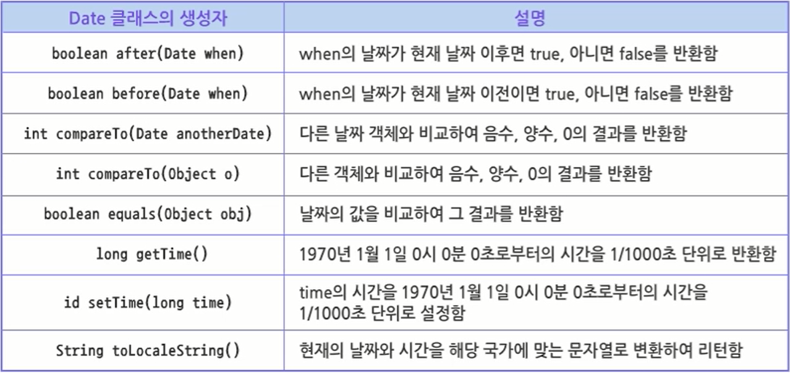
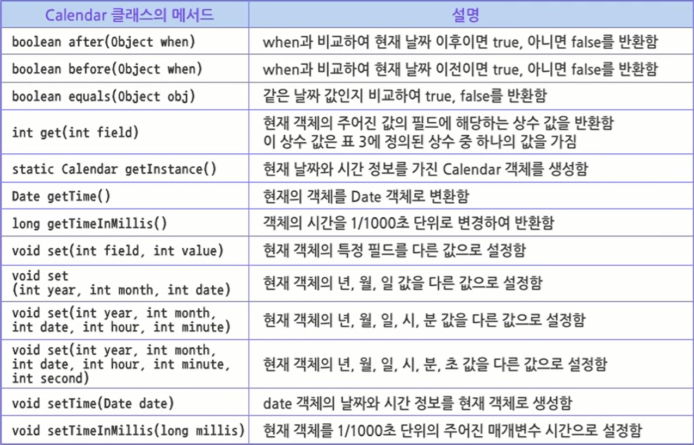
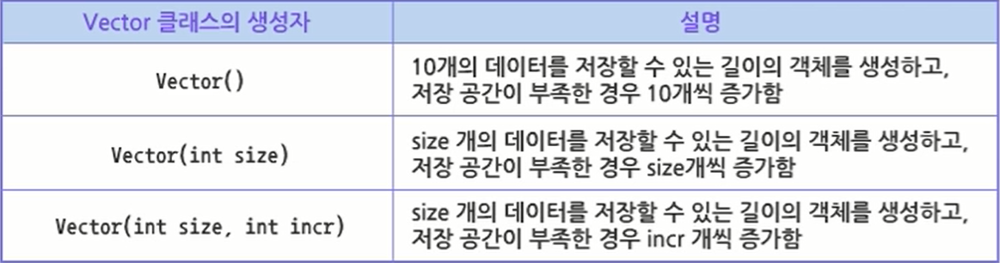
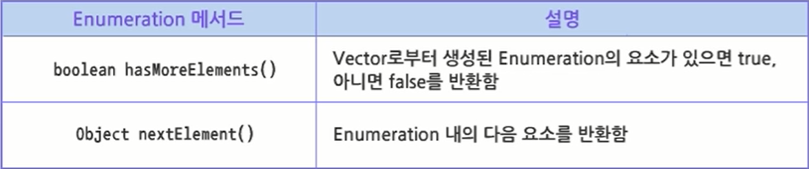

# java.util 패키지

Commit: No

# 14. java.util 패키지

## 14.1 java.util 개요 및 Utility 클래스

### 14.1.1 java.util 패키지 개요

- java.util 패키지
    - 자바 프로그램을 개발할 때 유용한 기능들을 모아놓은 패키지
    - 클래스
        1. 날짜와 시간 표현 및 조작 : Data, Calendar
        2. 배열 : Vector, HashMap
        3. 다양한 형태의 출력 포맷 : Formatter
        4. 인터페이스 : Enumeration
- java.util 패키지 사용
    - 반복적으로 작성해야 하는 복잡한 코드를 간단하게 구현할 수 있음
- java.util.Arrays 예제
  
    ```java
    package sec01;
    
    import java.util.Arrays;
    
    public class ArraysTest {
    
    	public static void main(String[] args) {
    		// TODO Auto-generated method stub
    
    		int[] scoreList = { 87, 56, 79, 98, 34, 55, 76 };
    
    		Arrays.sort(scoreList); // 데이터 정렬
    
    		for (int i = 0; i < scoreList.length; i++) {
    			System.out.print(scoreList[i] + ", ");
    		}
    
    		System.out.println("");
    		System.out.println("최저점 : " + scoreList[0]);
    		System.out.println("최고점 : " + scoreList[6]);
    
    	}
    
    }
    ```
    
    - 결과
      
        ```jsx
        34, 55, 56, 76, 79, 87, 98, 
        최저점 : 34
        최고점 : 98
        ```
        

### 14.1.2 날짜 관련 클래스

- Date 클래스
    - 형식이 있는 날짜와 시간을 출력하는 클래스
    - JDK 버전이 향상되면서 Deprecate 메서드들도 많아짐
        - Deprecate 메서드는 호환성이 떨어지고 이후 버전에서는 지원되지 않을 수 있으니 사용하지 않는 것이 좋음
    - 생성자
        1. `Date()` : 현재 날짜와 시간을 저장한 객체 생성
        2. `Date(long msec)` : 1970년 1월 1일 0시 0분 0초부터 msec를 1/1000초 단위로 하여 경과한 날짜와 시간을 저장한 객체를 생성함
- Date 클래스 주요 메서드
  
    
    
- Date 클래스 예제
  
    ```java
    package sec01;
    
    import java.util.Date;
    
    public class DateTest {
    
    	public static void main(String[] args) {
    		// TODO Auto-generated method stub
    
    		Date currentDate = new Date();
    		long start = currentDate.getTime();
    
    		System.out.println(currentDate.toString());
    		System.out.println(currentDate.toLocaleString());
    
    		currentDate = new Date();
    		long end = currentDate.getTime();
    
    		System.out.println("프로그램 수행에 걸린 시간 : " + (end - start) + "(ms)초");
    
    	}
    
    }
    ```
    
    - 결과
      
        ```jsx
        Thu Jan 13 20:56:24 KST 2022
        2022. 1. 13. 오후 8:56:24
        프로그램 수행에 걸린 시간 : 81(ms)초
        ```
    
- Calendar 클래스
    - 날짜와 시간에 관한 정보를 출력할 때 사용
    - 추상 클래스이므로 직접 객체 생성 불가
      
        ⇒ `getInstance()` 메서드를 이용하여 객체 생성 가능
        
    - 구문
      
        ```java
        Calendar cal2 = Calendar.getInstance();
        ```
    
- Calendar 클래스의 상수 `int` 데이터 타입
  
    
    
- Calendar 클래스 주요 메서드
  
    
    
- Calendar 클래스 예제
  
    ```java
    package sec01;
    
    import java.util.Calendar;
    
    public class CalendarTest {
    
    	public static void main(String[] args) {
    		// TODO Auto-generated method stub
    
    		Calendar cal = Calendar.getInstance();
    
    		int year = cal.get(Calendar.YEAR);
    		int mon = cal.get(Calendar.MONTH) + 1;
    		int day = cal.get(Calendar.DAY_OF_MONTH);
    		int hour = cal.get(Calendar.HOUR_OF_DAY);
    		int min = cal.get(Calendar.MINUTE);
    		int sec = cal.get(Calendar.SECOND);
    
    		System.out.println("현재 시간");
    		System.out.println(year + "년 " + mon + "월 " + day + "일");
    		System.out.println(hour + "시 " + min + "분 " + sec + "초");
    
    	}
    
    }
    ```
    
    - 결과
      
        ```jsx
        현재 시간
        2022년 1월 13일
        21시 5분 49초
        ```
        

### 14.1.3 Formatter 클래스

- Formatter 클래스
    - 형식화된 문자열을 출력하기 위해서 C 언어의 `printf()`와 같은 기능의 클래스
    - Formatter 클래스는 형식 문자열을 제공하고, 문자열에서 지정한대로 데이터가 형식화되어 출력됨
- Formatter 클래스 객체 생성 과정
    - 구문
      
        ```java
        Formatter formatter = new Formatter(Appendable a);
        ```
        
    - Formatter에서 형식화된 문자열을 만들었을 때 결과가 저장되는 곳
    - Appendable 인터페이스를 구현한 대표적인 클래스가 StringBuffer
    - 예시
      
        ```java
        StringBuffer sb = new StringBuffer();
        Formatter formatter = new Formatter(sb);
        ```
        
        - StringBuffer 클래스의 객체에 대해 Formatter를 지정하는 문장
        - Formatter 객체에서 적용한 출력 포맷 결과가 StringBuffer 객체에 저장됨
- StringBuffer를 Formatter 객체에 적용한 결과
    - 구문
      
        ```java
        Formatter format(String format, Object... obj)
        ```
        
        - 두 번째 매개변수로 가변적 매개변수를 사용하는 이유 : 몇 개의 데이터를 형식화된 출력으로 지정할 것인지 사전에 확정할 수 없기 때문
        - String 타입의 format 문자열(첫 번째 매개변수)은 출력하고자 하는 문자열 형태로 지정하고 중간에 %로 시작하는 format을 지정
        - format 문자열의 개수는 Object 타입의 가변형 매개변수 개수와 동일해야 함
- Formatter 클래스의 format들
    - 다양한 형식과 타입을 지원
    - Date나 Calendar 클래스를 매개변수로 받아 날짜를 출력하는 `%t format`에는 부가적인 옵션이 붙음
- Formatter 클래스 예제
  
    ```java
    package sec01;
    
    import java.util.Calendar;
    import java.util.Formatter;
    
    public class FormatterTest {
    
    	public static void main(String[] args) {
    		// TODO Auto-generated method stub
    
    		StringBuffer sb = new StringBuffer();
    		Formatter formatter = new Formatter(sb);
    
    		Calendar cal = Calendar.getInstance();
    
    		int i = 10;
    		int j = 20;
    		int k = i + j;
    		String str = "<< 연산 결과 >>";
    
    		formatter.format("%s%n", str);
    		formatter.format("%d와 %d를 더하면 %d가 됩니다. %n", i, j, k);
    		formatter.format("현재 시간은 %tk시 %tM분 %tS초입니다. %n", cal, cal, cal);
    
    		System.out.println(formatter.toString());
    
    	}
    
    }
    ```
    
    - 결과
      
        ```jsx
        << 연산 결과 >>
        10와 20를 더하면 30가 됩니다. 
        현재 시간은 21시 20분 17초입니다.
        ```
        

## 14.2 기본 Collection

### 14.2.1 Collection 개요

- 배열의 한계
    - 자바의 배열은 고정 길이를 사용함
      
        ⇒ 배열의 길이가 증가되거나 감소할 수 없음
        
    - 배열의 크기를 벗어나는 인덱스에 접근하면 `java.lang.ArrayIndexOutOfBoundsException`이 발생
    - 배열 객체를 생성할 때 몇 개를 저장할지 미리 알아야 하기 때문에 사용하기 불편함
- Vector 클래스
    - 자바는 동적인 길이로 다양한 객체들을 저장하기 위해 Vector 클래스를 제공함
    - Vector는 저장되는 객체들에 대한 참조 값을 저장하는 일종의 가변 길이의 배열
        - 가변 배열에는 객체만 저장 가능
        - 가변 크기로서 객체의 개수를 염려할 필요 없음
        - 한 객체가 삭제되면 컬렉션이 자동으로 자리를 옮겨줌
    - 다양한 객체들이 하나의 Vector에 저장될 수 있고, 길이도 필요에 따라 자동으로 증가됨
- Vector 클래스의 주요 생성자
  
    
    
- Vector 클래스의 주요 메서드
  
    
    
- Vector 클래스의 예제
  
    ```java
    package sec02;
    
    import java.util.Date;
    import java.util.Vector;
    
    public class VectorTest {
    
    	public static void main(String[] args) {
    		// TODO Auto-generated method stub
    
    		Vector list = new Vector(3);
    
    		System.out.println("저장 능력 : " + list.capacity());
    		System.out.println("저장 요소 개수 : " + list.size());
    
    		list.addElement(new Integer(10));
    		list.addElement(new Double(10.0));
    		list.addElement(new String("자바"));
    		list.addElement(new Date());
    
    		System.out.println("<< 네 개의 객체 저장 후 >>");
    		System.out.println("저장 능력 : " + list.capacity());
    		System.out.println("저장 요소 개수 : " + list.size());
    
    		if (list.contains("자바")) {
    			System.out.print("\"자바\" 스트링은 " + list.indexOf("자바"));
    			System.out.println(" 번 인덱스에 존재한다.");
    		}
    
    		System.out.println("<< Vector에 저장된 요소들 >>");
    
    		for (int i = 0; i < list.size(); i++) {
    			System.out.println(i + "번째 요소는 " + list.elementAt(i));
    		}
    
    	}
    
    }
    ```
    
    - 결과
      
        ```java
        저장 능력 : 3
        저장 요소 개수 : 0
        << 네 개의 객체 저장 후 >>
        저장 능력 : 6
        저장 요소 개수 : 4
        "자바" 스트링은 2 번 인덱스에 존재한다.
        << Vector에 저장된 요소들 >>
        0번째 요소는 10
        1번째 요소는 10.0
        2번째 요소는 자바
        3번째 요소는 Thu Jan 13 21:35:09 KST 2022
        ```
    
- Enumeration 인터페이스
    - 객체들의 집합(Vector)에서 각각의 객체들을 한 순간에 하나씩 처리할 수 있는 메서드를 제공함
    - 인터페이스이기 때문에 직접 `new` 연산자를 이용하여 객체를 생성할 수 없음
- Enumeration 인터페이스 메서드
  
    
    
    - Enumeration 인터페이스에서 선언된 메서드는 그 인터페이스를 사용하는 클래스로 구현해서 사용해야 함
      
        ⇒ Vector 클래스의 `elements()` 라는 메서드에 의해 생성
        
    - Enumeration 객체 내의 메서드들은 모두 Vector 클래스에서 이미 구현하여 제공
- Enumeration 인터페이스 예제
  
    ```java
    package sec02;
    
    import java.util.Enumeration;
    import java.util.Vector;
    
    public class EnumerationTest {
    
    	public static void main(String[] args) {
    		// TODO Auto-generated method stub
    
    		Vector list = new Vector(5);
    
    		list.addElement(new Integer(10));
    		list.addElement(new Double(10.0));
    		list.addElement(new String("자바"));
    
    		System.out.println("<< Vector에 저장된 요소들 >>");
    
    		for (int i = 0; i < list.size(); i++) {
    			System.out.println("list의" + i + "번째 요소 : " + list.elementAt(i));
    		}
    
    		Enumeration e = list.elements();
    
    		System.out.println();
    		System.out.println("<< Vector로부터 생성한 Enumeration의 요소들 >>");
    
    		while (e.hasMoreElements()) {
    			System.out.println("e의 요소 : " + e.nextElement());
    		}
    
    	}
    
    }
    ```
    
    - 결과
      
        ```java
        << Vector에 저장된 요소들 >>
        list의0번째 요소 : 10
        list의1번째 요소 : 10.0
        list의2번째 요소 : 자바
        
        << Vector로부터 생성한 Enumeration의 요소들 >>
        e의 요소 : 10
        e의 요소 : 10.0
        e의 요소 : 자바
        ```
    
- Stack 클래스
    - 제일 마지막에 저장한 데이터를 제일 먼저 꺼내는 후입선출(LIFO; Last In First Out) 형태의 자료구조
    - top
        - 가장 최근에 입력된 데이터로 삽입, 삭제, 읽기 동작 발생
        - 데이터의 수에 따라 유동적으로 변함
        - 데이터가 삽입되면 증가하고, 삭제되면 감소함
    - bottom
        - 가장 먼저 입력된 데이터
        - 0으로 값이 고정되어 있음
    - push : top 값을 하나 증가시킨 후 새로운 데이터를 삽입함
    - pop : top이 가리키고 있는 자료 삭제 후 top 값을 하나 감소하도록 구현
    - peak
        - top이 가리키는 데이터를 읽는 작업
        - top 값에는 변화 없음
- Stack 클래스 예제
  
    ```java
    package sec02;
    
    import java.util.Stack;
    
    public class StackTest {
    
    	public static void main(String[] args) {
    		// TODO Auto-generated method stub
    
    		Stack<String> stack = new Stack<String>();
    
    		for (int i = 1; i <= 5; i++) {
    			stack.push("데이터-" + i);
    		}
    
    		System.out.println(stack.pop());
    		System.out.println(stack.pop());
    		System.out.println(stack.peek());
    		System.out.println(stack.peek());
    		System.out.println(stack.pop());
    		System.out.println(stack.pop());
    		System.out.println(stack.pop());
    
    	}
    
    }
    ```
    
    - 결과
      
        ```java
        데이터-5
        데이터-4
        데이터-3
        데이터-3
        데이터-3
        데이터-2
        데이터-1
        ```
    
- Queue 인터페이스
    - 큐는 줄이라는 의미
    - 가장 먼저 삽입된 데이터가 가장 먼저 제거되는 선입선출(FIFO; First In First Out) 형태의 자료구조
    - front : 가장 먼저 입력된 데이터
    - rear : 가장 최근에 입력된 데이터
    - front 값이 rear를 추월하게 되면 더 이상 제거할 데이터가 없는 상태로 자료가 하나도 없는 빈 큐를 의미
    - peek : front가 가리키는 데이터를 읽는 작업으로 front 값에 영향을 주지 않음
- Queue 예제
  
    ```java
    package sec02;
    
    import java.util.LinkedList;
    import java.util.Queue;
    
    public class QueueTest {
    
    	public static void main(String[] args) {
    		// TODO Auto-generated method stub
    
    		Queue<String> que = new LinkedList<String>();
    
    		for (int i = 1; i <= 3; i++) {
    			que.add("데이터-" + i);
    		}
    
    		System.out.println("<< 가장 앞에 있는 요소 >>");
    		System.out.println(que.peek());
    		System.out.println("<< 순차적으로 요소 꺼내기 >>");
    		System.out.println(que.poll());
    		System.out.println(que.poll());
    		System.out.println(que.poll());
    
    	}
    
    }
    ```
    
    - 결과
      
        ```java
        << 가장 앞에 있는 요소 >>
        데이터-1
        << 순차적으로 요소 꺼내기 >>
        데이터-1
        데이터-2
        데이터-3
        ```
        

### 14.2.2 Generics

- Collection API 주의할 점
    - Vector, Stack, Queue는 다른 타입의 Object들을 저장하고 관리하는 기능을 제공함
    - 실제 프로그램을 개발할 때는 다른 타입의 데이터를 저장할 일이 거의 없음
    - 다른 타입의 데이터들을 컬렉션에 저장함으로써 문제가 발생되는 경우도 있음
      
        ⇒ 자바에서 제공하는 컬렉션 객체가 특정 타입의 데이터만 저장하고 사용할 수 있도록 지원함
    
- Generics
    - 컬렉션에 저장할 객체의 타입을 제한해서 사용하도록 함
    - 타입의 안정성을 제공
    - 타입 체크와 형변환 과정 생략
    - 코드의 간결화
    - 문법
      
        ```java
        컬렉션<데이터 타입> 변수이름 = new 컬렉션<데이터 타입>();
        ```
    
- Generics 예제
  
    ```java
    package sec02;
    
    import java.util.Vector;
    
    public class GenericsTest {
    
    	public static void main(String[] args) {
    		// TODO Auto-generated method stub
    
    		Vector<Integer> list = new Vector<Integer>();
    
    		list.addElement(new Integer(100));
    		list.addElement(new Integer(95));
    //		list.addElement(new Double(99.6));
    
    		int sum = 0;
    
    		for (int i = 0; i < list.size(); i++) {
    			Integer score = list.elementAt(i);
    			sum = sum + score.intValue();
    		}
    
    		System.out.println("점수의 총합 : " + sum);
    
    	}
    
    }
    ```
    
    - 결과
      
        ```java
        점수의 총합 : 195
        ```
    
- Collection을 사용하는 확장 for 문
    - 배열을 포함한 컬렉션을 쉽게 사용할 수 있도록 향상된 for 문을 제공함
    - 구문
      
        ```java
        for (데이터 타입 접근 변수명 : 배열이나 컬렉션 참조 변수명) {
        	반복 문장;
        }
        ```
    
- 배열 확장 for 문 예제
  
    ```java
    package sec02;
    
    public class ForTest {
    
    	public static void main(String[] args) {
    		// TODO Auto-generated method stub
    
    		int[] scoreList = { 50, 45, 99, 85, 100 };
    		int scoreSum = 0;
    
    		for (int score : scoreList) {
    			scoreSum = scoreSum + score;
    		}
    
    		System.out.println("점수의 총합 : " + scoreSum);
    
    	}
    
    }
    ```
    
    - 결과
      
        ```java
        점수의 총합 : 379
        ```
    
- Collection 확장 for 문 예제
  
    ```java
    package sec02;
    
    import java.util.Vector;
    
    public class ForTest2 {
    
    	public static void main(String[] args) {
    		// TODO Auto-generated method stub
    
    		Vector<String> subjectList = new Vector<String>();
    
    		subjectList.add("Java");
    		subjectList.add("SQL");
    		subjectList.add("Servlet");
    
    		for (String subject : subjectList) {
    			System.out.println(subject);
    		}
    
    	}
    
    }
    ```
    
    - 결과
      
        ```java
        Java
        SQL
        Servlet
        ```
        

---