# 컬렉션 프레임워크

Commit: No

# 15. 컬렉션 프레임워크

## 15.1 컬렉션 프레임워크

### 15.1.1 컬렉션 개요

- 자료구조
    - 일정한 규칙에 의해 데이터들이 모아져 있는 것을 의미
    - 배열 : 자료구조 중에서 가장 기본이고 단순한 구조이며 동일한 타입의 데이터들의 집합
    - 배열은 초기에 지정한 크기를 바꿀 수 없기 때문에 생성한 크기보다 많은 자료를 저장할 수 없음
    - 데이터의 삽입, 검색, 삭제 등의 기능을 매번 직접 작성하여 개발할 경우 중복되는 로직들이 발생함
      
        ⇒ 배열에 데이터를 삽입, 검색, 삭제 등의 기능을 클래스로 구현하면 재사용성을 높일 수 있음
    
- 배열의 재사용성을 높인 클래스 예제
  
    ```java
    package sec01;
    
    public class MyArray {
    
    	private Object[] data;
    	private int count;
    
    	// maxSize 크기 만큼의 Object 배열 객체를 생성하는 생성자
    	public MyArray(int maxSize) {
    
    		if (maxSize < 0) {
    			throw new IllegalArgumentException();
    		}
    
    		this.data = new Object[maxSize];
    		this.count = 0;
    	}
    
    	// 매개변수로 받은 객체를 배열 마지막 요소에 저장하는 메서드
    	public void add(Object obj) {
    
    		if (count >= data.length) {
    			throw new ArrayIndexOutOfBoundsException();
    		}
    
    		data[count++] = obj;
    	}
    
    	// 매개변수로 받은 index 위치의 요소를 배열에서 삭제하는 메서드
    	public void remove(int index) {
    
    		if (index >= count) {
    			throw new ArrayIndexOutOfBoundsException();
    		} else if (index < 0) {
    			throw new ArrayIndexOutOfBoundsException();
    		}
    
    		for (int i = index; i < count - 1; i++) {
    			data[i] = data[i + 1];
    		}
    
    		count--;
    		data[count] = null;
    	}
    
    	// 매개변수로 받은 index 위치의 요소를 리턴하는 메서드
    	public Object get(int index) {
    		if (index >= count) {
    			throw new ArrayIndexOutOfBoundsException();
    		}
    		return data[index];
    	}
    
    	@Override
    	public String toString() {
    		// TODO Auto-generated method stub
    		StringBuffer str = new StringBuffer("[");
    
    		if (count > 0) {
    			str.append(data[0]);
    		}
    
    		for (int i = 1; i < count; i++) {
    			str.append(", ").append(data[i]);
    		}
    
    		str.append("]");
    
    		return str.toString();
    	}
    
    }
    ```
    
    ```java
    package sec01;
    
    public class MyArrayTest {
    
    	public static void main(String[] args) {
    		// TODO Auto-generated method stub
    
    		// 객체 생성
    		MyArray arr = new MyArray(5);
    
    		// 데이터 저장
    		for (int i = 1; i <= 5; i++) {
    			arr.add("데이터-" + i);
    		}
    
    		System.out.println("<< MyArray 객체에 저장된 요소들 >>");
    		System.out.println(arr.toString());
    
    		System.out.println("<< MyArray 0번 index에 저장된 요소 >>");
    		System.out.println(arr.get(0));
    
    		System.out.println("<< MyArray 3번 index에 저장된 요소 >>");
    		System.out.println(arr.get(3));
    
    		arr.remove(3);
    
    		System.out.println("<< 3번 index 요소 삭제 후 요소들 >>");
    		System.out.println(arr.toString());
    
    		arr.add("데이터-4");
    
    		System.out.println("<< 새로운 데이터 등록 후 요소들 >>");
    		System.out.println(arr);
    
    	}
    
    }
    ```
    
    - 결과
      
        ```
        << MyArray 객체에 저장된 요소들 >>
        [데이터-1, 데이터-2, 데이터-3, 데이터-4, 데이터-5]
        << MyArray 0번 index에 저장된 요소 >>
        데이터-1
        << MyArray 3번 index에 저장된 요소 >>
        데이터-4
        << 3번 index 요소 삭제 후 요소들 >>
        [데이터-1, 데이터-2, 데이터-3, 데이터-5]
        << 새로운 데이터 등록 후 요소들 >>
        [데이터-1, 데이터-2, 데이터-3, 데이터-5, 데이터-4]
        ```
    
- 컬렉션 프레임워크
    - 프로그램에서 사용할 데이터들을 효과적으로 관리하고 사용할 수 있도록 다양한 기능의 클래스 제공
    - 기존 Vector, Stack, Properties는 각각의 사용법이 다르고 상호 호환성이 떨어져 확장성이 떨어짐
    - 컬렉션 프레임워크는 높은 성능으로 동작하고 상호 운용성이 뛰어나며 응용 및 확장성이 뛰어남
        - 표준 인터페이스들의 집합에 기초를 두고 구현되었기 때문에 가능

### 15.1.2 컬렉션 API

- 컬렉션 관련 인터페이스
    - 컬렉션은 몇 개의 표준 인터페이스를 구현하는 클래스들로 구성됨
    - 종류 : Collection, List, Set, SortedSet
- Collection 인터페이스
    - 컬렉션 프레임워크의 토대가 되는 인터페이스로 모든 컬렉션 클래스가 가지고 있는 핵심 메서드로 구성되어 있음
    - 추상 메서드
      
        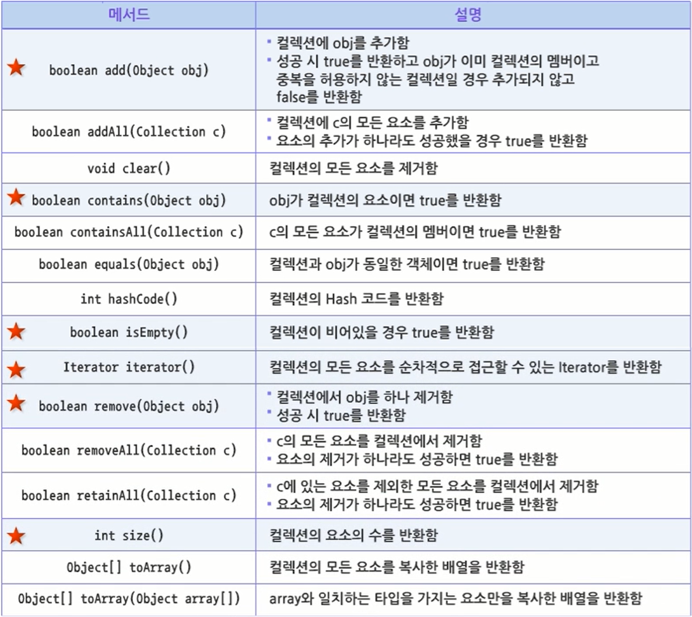
    
- List 인터페이스
    - Collection 인터페이스를 확장했으며 요소들의 순서를 저장하는 기능이 추가됨
    - 0부터 시작하는 index를 사용하여 특정 위치에 요소를 삽입하거나 특정 위치의 요소를 꺼낼 수 있음
    - 동일한 요소여도 순서를 가지고 구분하기 때문에 요소의 중복 저장이 가능
    - 주요 메서드
      
        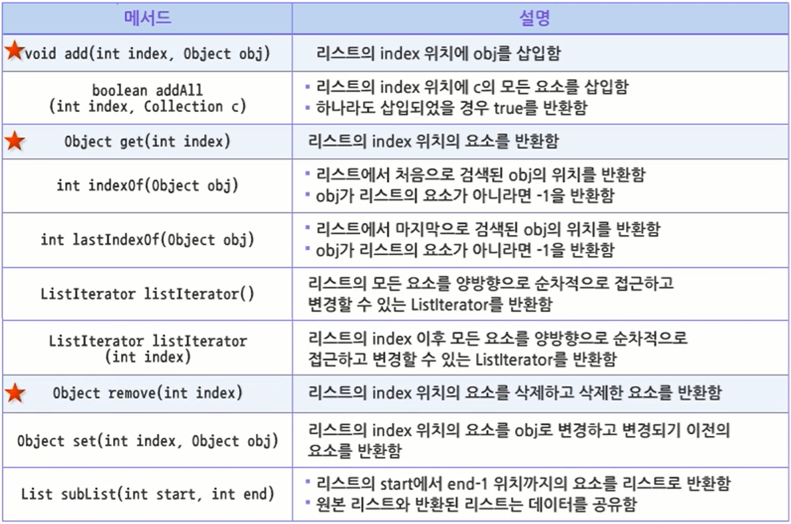
    
- Set 인터페이스
    - Collection 인터페이스를 확장했으며 중복되지 않는 요소들의 집합을 선언
    - 동일한 요소의 중복을 허용하지 않기 때문에 이미 저장된 객체를 `add()` 메서드로 다시 저장하려고 할 때 `false` 반환
    - 추가적인 메서드는 선언되어 있지 않음
- SortedSet 인터페이스
    - Set 인터페이스를 확장
    - 오름차룬으로 정렬된 집합의 동작을 선언
    - 주요 메서드
      
        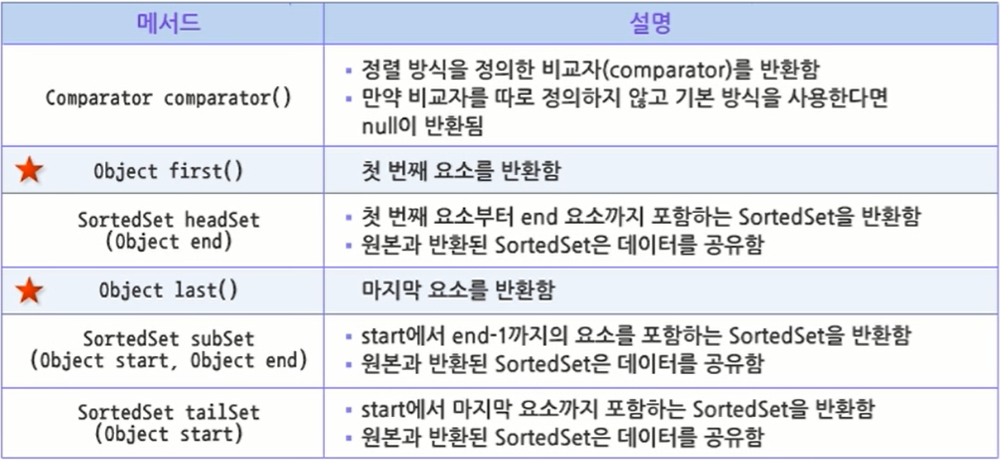
        

### 15.1.3 컬렉션 클래스

- 컬렉션 클래스
    - 구현한 인터페이스의 특징을 그대로 가지고 있음
    - 몇몇 클래스들은 추상 클래스로 작성되어 실제 동작이 가능한 자식 클래스의 골격을 제공
    - 컬렉션 클래스
      
        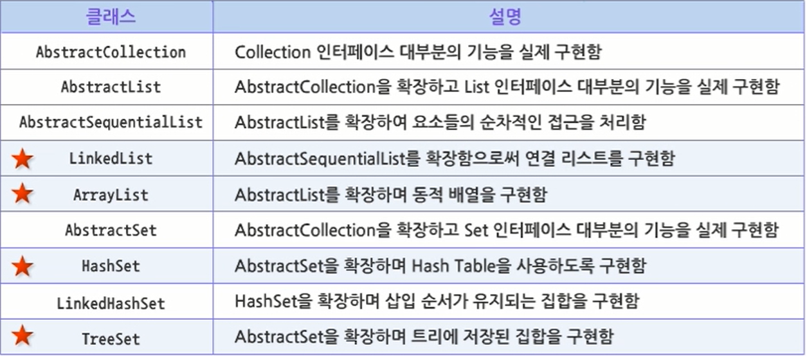
    
- ArrayList 클래스
    - AbstractList를 확장하고 List 인터페이스를 구현
    - 내부적으로 배열을 이용하여 리스트 자료구조를 구현
    - 동적 배열을 지원하기때문에 초기 값을 넘어서는 객체를 삽입하는 경우 그 크기가 늘어나고 반대로 객체를 제거하는 경우 그 크기가 줄어듦
    - 생성자
      
        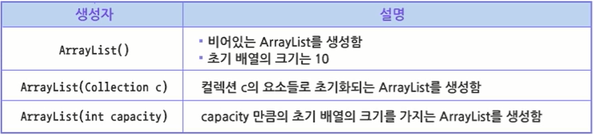
        
    - AbstractList 클래스와 List 인터페이스의 모든 메서드를 사용할 수 있음
    - 메서드
      
        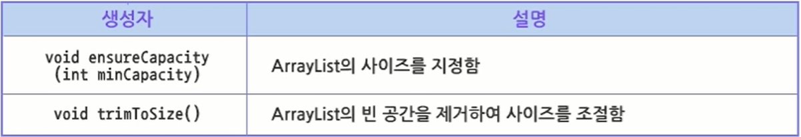
    
- ArrayList 예제
  
    ```java
    package sec01;
    
    import java.util.ArrayList;
    
    public class ArrayListTest {
    
    	public static void main(String[] args) {
    		// TODO Auto-generated method stub
    
    		// 객체 생성
    		ArrayList<Double> scoreList = new ArrayList<Double>();
    
    		scoreList.add(9.5);
    		scoreList.add(8.4);
    		scoreList.add(1, 9.2); // 1번 인덱스에 9.2로 저장하여 기존 인덱스에 저장한 자료들이 다음 인덱스로 밀려남
    		scoreList.add(9.5);
    
    		System.out.println(scoreList.toString());
    
    		double maxScore = 0;
    		double minScore = 100;
    		double score = 0;
    
    		for (int i = 0; i < scoreList.size(); i++) {
    			score = scoreList.get(i);
    
    			if (score < minScore) {
    				minScore = score;
    			} else if (score > maxScore) {
    				maxScore = score;
    			}
    		}
    
    		scoreList.remove(maxScore);
    		scoreList.remove(minScore);
    
    		System.out.println(scoreList.toString());
    
    		double sum = 0;
    
    		for (int i = 0; i < scoreList.size(); i++) {
    			sum += scoreList.get(i);
    		}
    
    		System.out.println("최고 점수 : " + maxScore);
    		System.out.println("최저 점수 : " + minScore);
    		System.out.println("평균 점수 : " + (sum / scoreList.size()));
    
    	}
    
    }
    ```
    
    - 결과
      
        ```
        [9.5, 9.2, 8.4, 9.5]
        [9.2, 9.5]
        최고 점수 : 9.5
        최저 점수 : 8.4
        평균 점수 : 9.35
        ```
    
- LinkedList 클래스
    - AbstractSequentialList를 확장하고 List 인터페이스를 구현함
    - 이중 연결 리스트(Doubly Linked List) 형태의 자료구조를 구현함
    - 생성자
      
        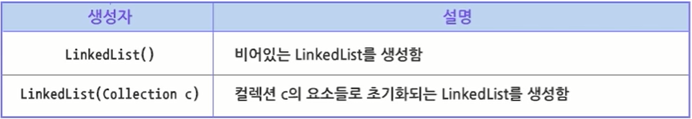
        
    - AbstractSequentialList 클래스와 List 인터페이스의 모든 메서드를 사용
    - 첫 요소나 마지막 요소에 삽입, 삭제가 효율적으로 이루어지므로 이에 대한 추가적인 메서드를 제공
    - 메서드
      
        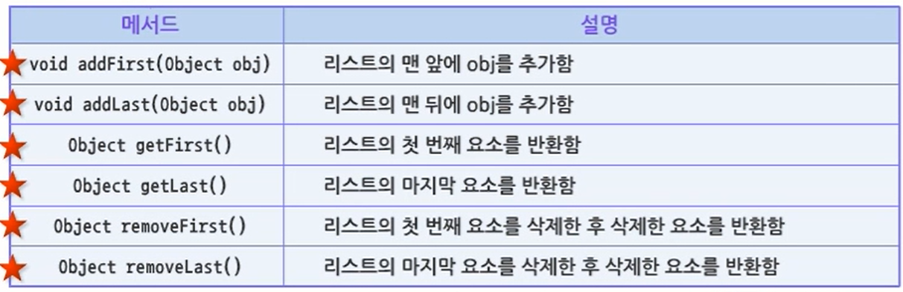
    
- LinkedList 예제
  
    ```java
    package sec01;
    
    import java.util.LinkedList;
    
    public class LinkedListTest {
    
    	public static void main(String[] args) {
    		// TODO Auto-generated method stub
    
    		LinkedList<Double> scoreList = new LinkedList<Double>();
    
    		scoreList.add(9.5);
    		scoreList.addFirst(8.4); // 원래 맨 앞에 있던 점수가 다음 인덱스로 밀리고 저장됨
    		scoreList.add(9.2);
    		scoreList.add(9.5);
    
    		System.out.println(scoreList.toString());
    
    		double maxScore = scoreList.getLast();
    		double minScore = scoreList.getFirst();
    
    		scoreList.removeFirst();
    		scoreList.removeLast();
    
    		System.out.println(scoreList.toString());
    
    		double sum = 0;
    
    		for (int i = 0; i < scoreList.size(); i++) {
    			sum += scoreList.get(i);
    		}
    
    		System.out.println("최고 점수 : " + maxScore);
    		System.out.println("최저 점수 : " + minScore);
    		System.out.println("평균 점수 : " + (sum / scoreList.size()));
    
    	}
    
    }
    ```
    
    - 결과
      
        ```
        [8.4, 9.5, 9.2, 9.5]
        [9.5, 9.2]
        최고 점수 : 9.5
        최저 점수 : 8.4
        평균 점수 : 9.35
        ```
    
- HashSet 클래스
    - AbstractSet을 확장하고 Set 인터페이스를 구현함
    - 데이터 저장소로 Hash Table을 사용하기 때문에 Hash 형태의 자료구조를 구현함
    - 객체의 저장이나 삭제 시 내부적으로 대상 객체를 hashing하여 HashCode를 만든 뒤 Hash Table의 index로 사용
    - 객체를 hashing하는 작업은 자동으로 수행되기 때문에 Hash Table을 직접 접근할 수 없음
    - 삽입, 삭제 등의 작업이 데이터의 수와 관계없이 일정한 성능을 보장
    - 생성자
      
        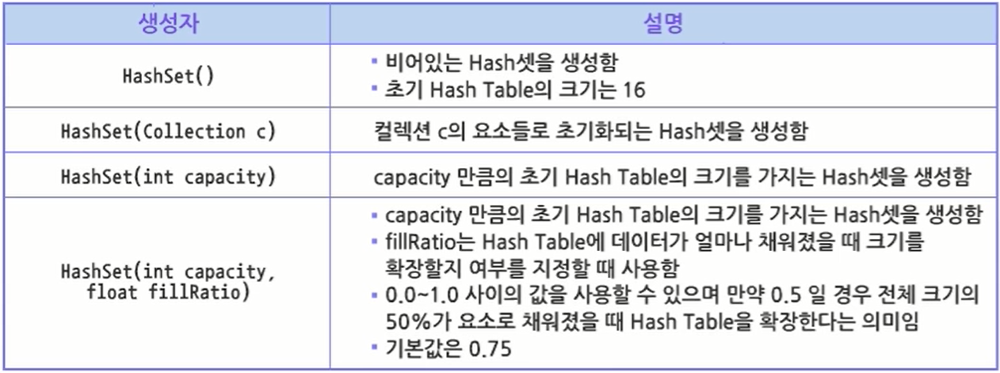
        
    - AbstractSet 클래스와 Set 인터페이스의 모든 메서드를 사용할 수 있으며, 추가적인 메서드는 정의하지 않음
- HashSet 예제
  
    ```java
    package sec01;
    
    import java.util.HashSet;
    
    public class HashSetTest {
    
    	public static void main(String[] args) {
    		// TODO Auto-generated method stub
    
    		HashSet<String> set = new HashSet<String>();
    
    		set.add("9.5");
    		set.add("8.4");
    		set.add("9.2");
    		set.add("9.5"); // 이미 저장된 데이터이기 때문에 무시됨
    		set.add("6.7");
    
    		System.out.println(set.toString());
    
    		set.remove("9.2");
    
    		System.out.println(set.toString());
    
    	}
    
    }
    ```
    
    - 결과
      
        ```
        [9.5, 9.2, 8.4, 6.7]
        [9.5, 8.4, 6.7]
        ```
    
- LinkedHashSet클래스
    - HashSet을 확장하고 Set 인터페이스를 구현
    - HashSet은 삽입된 순서를 기억하지 않지만 LinkedHashSet은 연결 리스트를 이용하여 순서를 기억함
    - 생성자는 HashSet과 동일
    - 추가적인 메서드는 정의되지 않음
- LinkedHashSet 예제
  
    ```java
    package sec01;
    
    import java.util.LinkedHashSet;
    
    public class LinkedHashSetTest {
    
    	public static void main(String[] args) {
    		// TODO Auto-generated method stub
    
    		LinkedHashSet<String> set = new LinkedHashSet<String>();
    
    		set.add("9.5");
    		set.add("8.4");
    		set.add("9.2");
    		set.add("9.5");
    		set.add("6.7");
    
    		System.out.println(set.toString());
    
    		set.remove("9.2");
    		System.out.println(set.toString());
    
    	}
    
    }
    ```
    
    - 결과
      
        ```
        [9.5, 8.4, 9.2, 6.7]
        [9.5, 8.4, 6.7]
        ```
    
- TreeSet 클래스
    - AbstractSet을 확장하며 SortedSet 인터페이스를 구현
    - 오름차순으로 정렬된 Set 집합을 사용할 수 있음
    - 기억장소로 트리를 사용하여 빠른 접근 속도를 가지므로 많은 양의 데이터를 정렬하여 사용할 때 유용
    - 생성자
      
        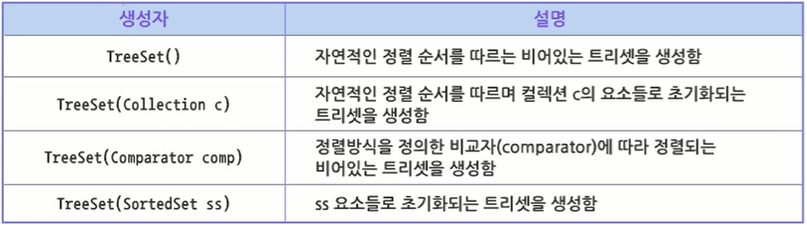
    
- TreeSet 예제
  
    ```java
    package sec01;
    
    import java.util.TreeSet;
    
    public class TreeSetTest {
    
    	public static void main(String[] args) {
    		// TODO Auto-generated method stub
    
    		TreeSet<String> set = new TreeSet<String>();
    
    		set.add("9.5");
    		set.add("8.4");
    		set.add("9.2");
    		set.add("9.5");
    		set.add("6.7");
    
    		System.out.println(set.toString());
    
    		set.remove("9.2");
    		System.out.println(set.toString());
    
    	}
    
    }
    ```
    
    - 결과
      
        ```
        [6.7, 8.4, 9.2, 9.5]
        [6.7, 8.4, 9.5]
        ```
    
- Iterator 인터페이스
    - 컬렉션 클래스의 모든 요소를 처음부터 끝까지 순차적으로 접근 가능하도록 해주는 인터페이스
    - 컬렉션 클래스의 모든 요소를 간단하고 통일된 방법으로 처리할 수 있는 방법 제공
    - 직접 객체를 생성할 수 없고, 컬렉션 클래스의 iterator() 메서드를 통하여 객체를 얻을 수 있음
    - 메서드
      
        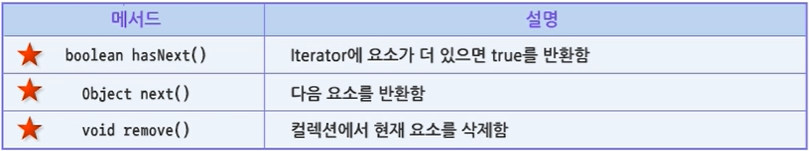
    
- Iterator 예제
  
    ```java
    package sec01;
    
    import java.util.Iterator;
    import java.util.LinkedList;
    
    public class IteratorTest {
    
    	public static void main(String[] args) {
    		// TODO Auto-generated method stub
    
    		LinkedList<Double> scoreList = new LinkedList<Double>();
    
    		scoreList.add(new Double(9.5));
    		scoreList.add(new Double(7.5));
    		scoreList.add(new Double(8.2));
    
    		System.out.println(scoreList.toString());
    
    		double sum = 0;
    
    		Iterator<Double> it = scoreList.iterator();
    
    		while (it.hasNext()) {
    			sum += it.next();
    		}
    
    		System.out.println("점수의 총합 : " + sum);
    
    	}
    
    }
    ```
    
    - 결과
      
        ```
        [9.5, 7.5, 8.2]
        점수의 총합 : 25.2
        ```
        

## 15.2 Map 컬렉션

### 15.2.1 Map

- Map 컬렉션
    - key, value의 쌍으로 데이터를 저장하는 객체
    - key는 유일해야 함
    - value는 중복 가능
    - 기능적으로 Collection 인터페이스와 다르기 때문에 Collection 인터페이스를 상속받지 않음
    - 인터페이스
      
        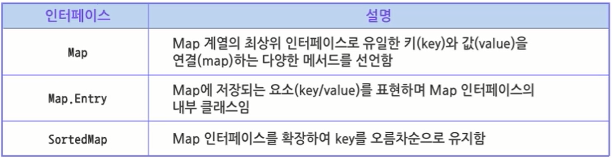
        
    - 클래스
      
        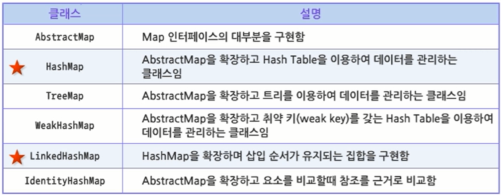
    
- Map 인터페이스
    - 메서드
      
        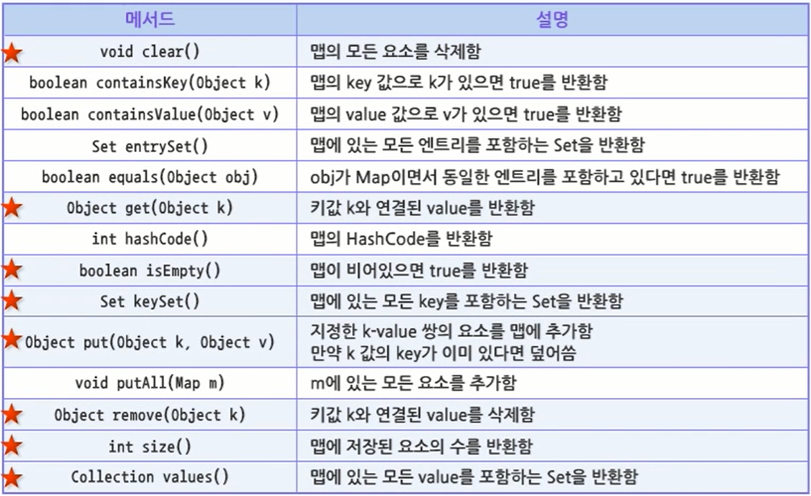
    
- HashMap 클래스
    - 키와 데이터 값의 한 쌍으로 묶어서 관리
    - 키의 중복을 허용하지 않음
    - HashMap, HashTable, TreeMap 클래스가 유사
    - Enumeration이나 Iterator 객체를 사용하여 데이터를 추출하지 않고 특정 키로 등록된 데이터를 추출
    - 메서드
      
        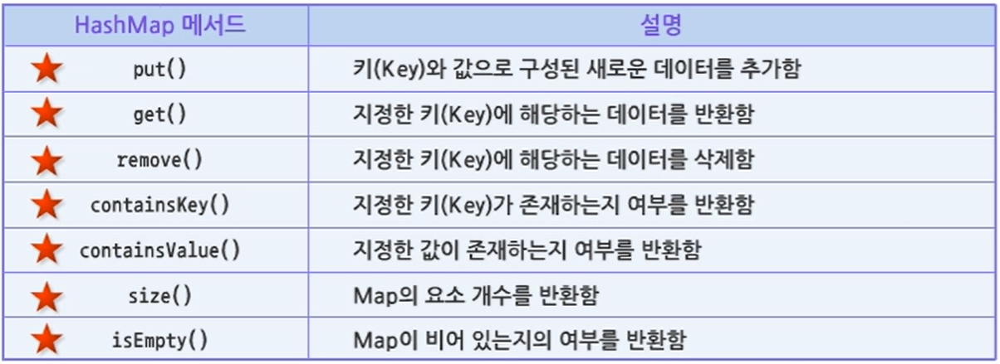
    
- HashMap 예제
  
    ```java
    package sec02;
    
    import java.util.HashMap;
    import java.util.Iterator;
    import java.util.Set;
    
    public class HashMapTest {
    
    	public static void main(String[] args) {
    		// TODO Auto-generated method stub
    
    		HashMap<String, String> map = new HashMap<String, String>();
    
    		map.put("김철수", "010-123-1111");
    		map.put("이유리", "010-123-1234");
    		map.put("박지성", "010-333-3333");
    
    		Set<String> keys = map.keySet();
    
    		System.out.println(keys.toString());
    
    		Iterator<String> it = keys.iterator();
    
    		while (it.hasNext()) {
    			String key = (String) it.next();
    
    			System.out.println(key + " : " + map.get(key));
    		}
    
    	}
    
    }
    ```
    
    - 결과
      
        ```
        [이유리, 박지성, 김철수]
        이유리 : 010-123-1234
        박지성 : 010-333-3333
        김철수 : 010-123-1111
        ```
    
- LinkedHashMap 예제
  
    ```java
    package sec02;
    
    import java.util.Iterator;
    import java.util.LinkedHashMap;
    import java.util.Set;
    
    public class LinkedHashMapTest {
    
    	public static void main(String[] args) {
    		// TODO Auto-generated method stub
    
    		LinkedHashMap<String, String> map = new LinkedHashMap<String, String>();
    
    		map.put("김철수", "010-123-1111");
    		map.put("이유리", "010-123-1234");
    		map.put("박지성", "010-333-3333");
    
    		Set<String> keys = map.keySet();
    
    		System.out.println(keys.toString());
    
    		Iterator<String> it = keys.iterator();
    
    		while (it.hasNext()) {
    			String key = (String) it.next();
    
    			System.out.println(key + " : " + map.get(key));
    		}
    
    	}
    
    }
    ```
    
    - 결과
      
        ```
        [김철수, 이유리, 박지성]
        김철수 : 010-123-1111
        이유리 : 010-123-1234
        박지성 : 010-333-3333
        ```
    
- TreeMap 예제
  
    ```java
    package sec02;
    
    import java.util.Iterator;
    import java.util.Set;
    import java.util.TreeMap;
    
    public class TreeMapTest {
    
    	public static void main(String[] args) {
    		// TODO Auto-generated method stub
    
    		TreeMap<String, String> map = new TreeMap<String, String>();
    
    		map.put("김철수", "010-123-1111");
    		map.put("이유리", "010-123-1234");
    		map.put("박지성", "010-333-3333");
    
    		Set<String> keys = map.keySet();
    
    		System.out.println(keys.toString());
    
    		Iterator<String> it = keys.iterator();
    
    		while (it.hasNext()) {
    			String key = (String) it.next();
    
    			System.out.println(key + " : " + map.get(key));
    		}
    
    	}
    
    }
    ```
    
    - 결과
      
        ```
        [김철수, 박지성, 이유리]
        김철수 : 010-123-1111
        박지성 : 010-333-3333
        이유리 : 010-123-1234
        ```
        

---