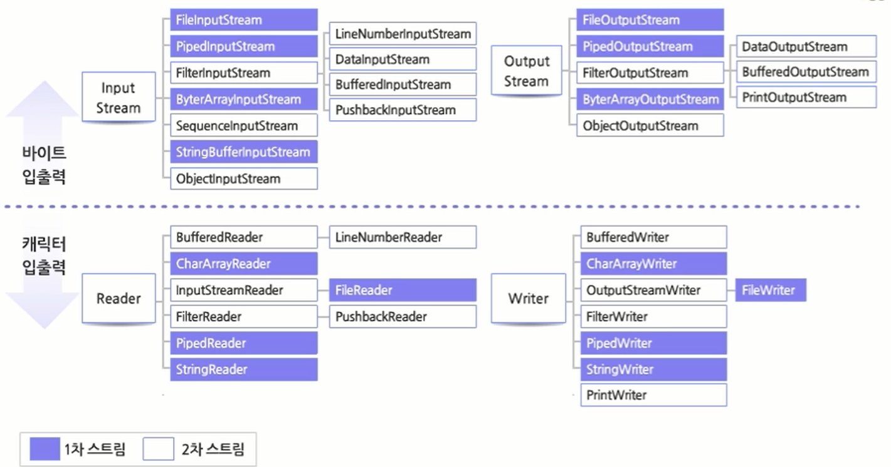
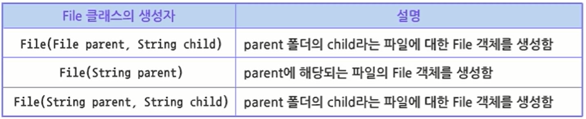
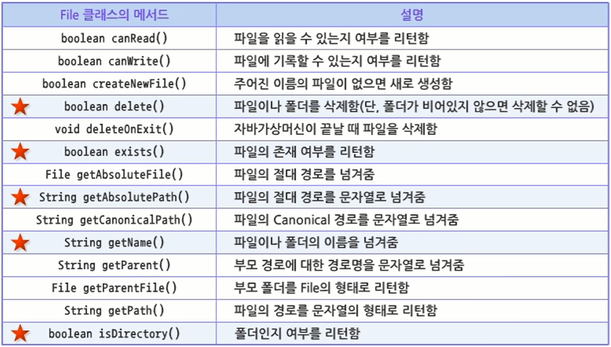
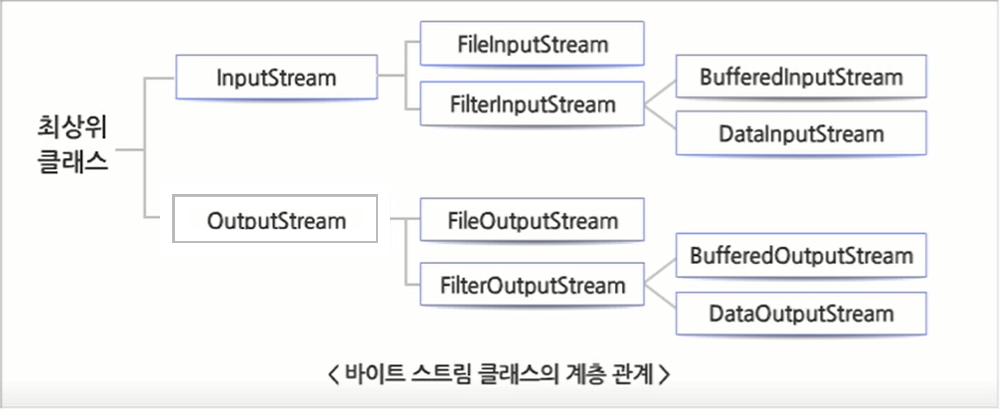
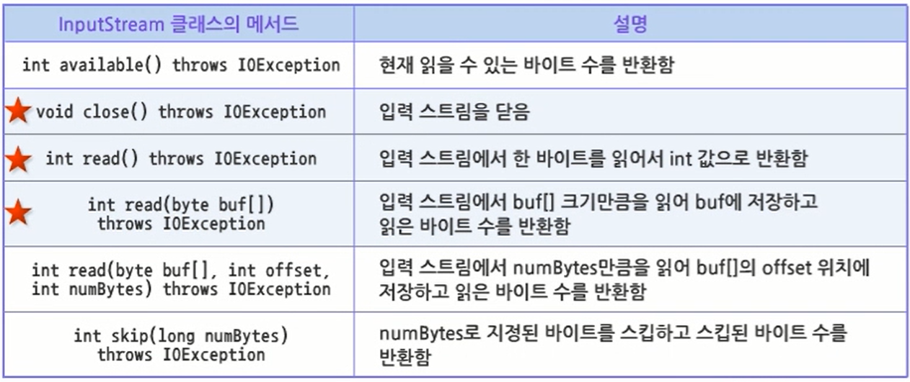
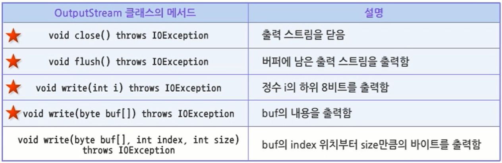
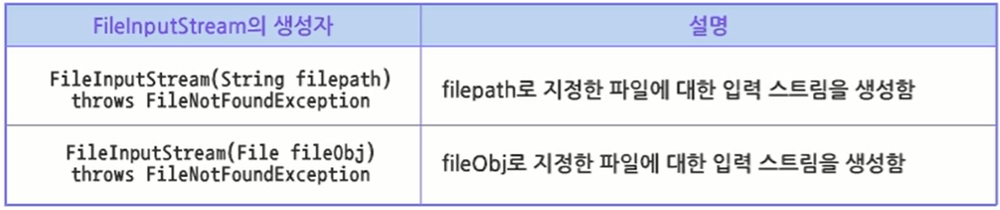
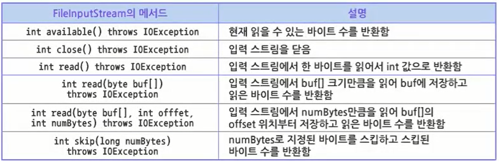
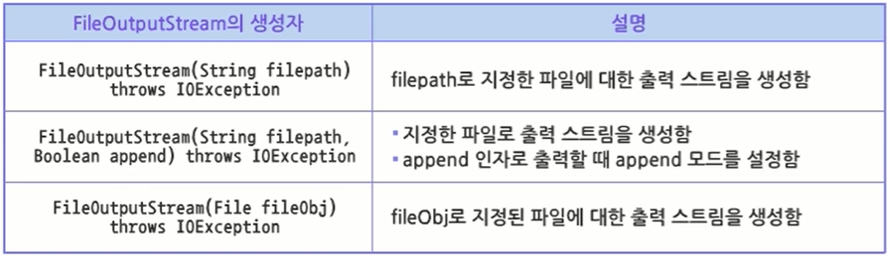
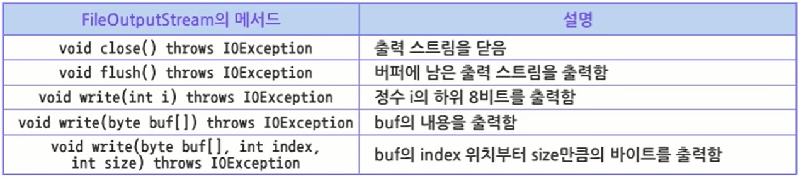

# 16. java.io 바이트 입출력

## 16.1 입출력 개요 및 입출력 API

### 16.1.1 입출력 개요

- 입출력 프로그래밍
    - 자바 프로그램이 필요로 하는 정보를 입력받아 처리하거나 프로그램 수행결과가 어떤 출력장치로 출력되도록 프로그램을 작성하는 경우 입출력 기능을 구현하는 것
- 입출력 스트림
    - 자바는 메모리, 파일, 네트워크 등 다양한 경로로의 입출력을 구현하는 일관된 방식 제공
    - stream : 순서가 있는 일련의 데이터
      
        
        
        - 입력 스트림 : 근원지에서 흘러 들어오는 데이터
        - 출력 스트름 : 목적지로 흘러가는 데이터
- 입출력 스트림 특징
    1. 순차적인 데이터의 흐름으로 데이터의 무작위적인 접근이 불가능함
    2. 단방향의 흐름으로 입력 스트림과 출력 스트림이 따로 존재함
    3. 모든 데이터의 입출력이 근원지, 목적지의 형태와 관계없이 일정한 형태로 전송됨
       
        ⇒ 동일한 방법으로 프로그램이 작성될 수 있는 유연한 구조의 API를 가짐
    
- java.io 패키지
    - 자바로 입출력 기능을 구현하는 프로그램을 개발하는데 필요한 다양한 클래스를 포함함
    - File 클래스 : 파일이나 폴더를 다루는데 이용됨
    - RandomAccessFile 클래스 : 파일에 무작위적인 접근을 가능하게 함
    - 스트림 클래스 : 입출력 스트림을 가능하게 함
- 스트림 클래스의 계층 구조
  
    
    
    
    
- 스트림 클래스의 분류
    1. 입출력 단위에 의한 분류
        1. 바이트 단위의 입출력 클래스
        2. 캐릭터 단위의 입출력 클래스
        - 바이트 단위와 캐릭터 단위는 서로 호환하지 않는 것을 원칙으로 함
    2. 데이터 이동 통로에 의한 분류
        1. 1차 스트림 클래스 : 데이터가 이동하는 통로를 직접 만드는 클래스
        2. 2차 스트림 클래스 : 이미 만들어져 있는 통로에 새로운 기능을 더하는 클래스
- 스트림 클래스
  
    
    
- File 클래스
    - 파일을 제어하기 위한 클래스
    - 파일과 디렉토리를 모두 표현하고 관리할 수 있음
    - 파일이 실제로 존재하는지 알 수 있음
    - 파일 복사 가능
    - 파일의 이름 변경 가능
    - 파일의 데이터를 입출력하기 위한 메서드는 제공하지 않음
    - File 클래스로부터 생성된 객체는 변경할 수 없음
      
        ⇒ File 객체에 의해 표현되는 추상 경로명은 절대로 변하지 않음
        
    - 생성자
      
        
        
    - 파일 클래스로부터 객체를 생성하는 일반적인 방법
      
        ```java
        File file = new File ("디렉토리 경로");
        
        File file = new File (" . "); // .은 현재 작업 디렉토리를 의미
        
        File file = new File (" ./파일명") // 현재 디렉토리 밑에 위치한 파일
        ```
        
    - 메서드
      
        
    
- 파일 정보를 확인하는 예제
  
    ```java
    package sec01;
    
    import java.io.File;
    import java.io.IOException;
    
    public class FileTest {
    
    	public static void main(String[] args) {
    		// TODO Auto-generated method stub
    
    		File file = new File("./src/sec01/FileTest.java"); // 파일에 대한 File 객체 생성
    
    		String fileName = file.getName(); // 생성된 파일 객체의 파일 이름 얻어냄
    
    		if (file.exists()) {
    
    			try {
    				System.out.println(fileName);
    				System.out.println(file.getPath());
    				System.out.println(file.getAbsolutePath());
    				System.out.println(file.getCanonicalPath());
    				System.out.println(file.getParent());
    
    				if (file.canWrite()) {
    					System.out.println(fileName + "은 쓸 수 있다.");
    				} else if (file.canRead()) {
    					System.out.println(fileName + "은 읽을 수 있다");
    				} else if (file.isFile()) {
    					System.out.println(fileName + "은 파일이다.");
    				} else {
    					System.out.println(fileName + "은 폴더다.");
    				}
    
    				System.out.println(fileName + "의 크기 : " + file.length());
    
    			} catch (IOException e) {
    				// TODO: handle exception
    				System.err.println(e);
    			}
    
    		} else {
    			System.out.println("파일을 찾을 수 없다. : " + fileName);
    		}
    
    	}
    
    }
    ```
    
    - 결과
      
        ```
        FileTest.java
        .\src\sec01\FileTest.java
        C:\dev\workspace(SuhoPark)\Chapter 16\.\src\sec01\FileTest.java
        C:\dev\workspace(SuhoPark)\Chapter 16\src\sec01\FileTest.java
        .\src\sec01
        FileTest.java은 쓸 수 있다.
        FileTest.java의 크기 : 1189
        ```
    
- 디렉토리와 파일 목록을 출력하는 예제
  
    ```java
    package sec01;
    
    import java.io.File;
    
    public class DirTest {
    
    	public static void main(String[] args) {
    		// TODO Auto-generated method stub
    
    		File dir = new File("./src/sec01");
    
    		if (dir.isDirectory()) {
    			String[] fileList = dir.list();
    
    			for (int i = 0; i < fileList.length; i++) {
    				System.out.println(fileList[i]);
    			}
    		} else {
    			System.out.println("File 객체는 폴더가 아니다.");
    		}
    
    	}
    
    }
    ```
    
    - 결과
      
        ```
        DirTest.java
        FileTest.java
        ```
        

## 16.2 바이트 스트림

### 16.2.1 바이트 스트림

- 바이트 스트림 계층 관계
  
    
    
- 바이트 스트림
    - 모두 바이트 단위로 입출력 수행
    - 각 클래스들만의 고유한 기능을 가짐
    - 입출력 장치를 대상으로 직접 입출력하는 클래스와 다른 클래스를 대상으로 입출력하는 클래스가 있음
    - 자바에서는 두 개 이상의 클래스를 연결한 입출력 스트림을 생성해서 입출력하는 경우가 일반적
- InputStream
    - 바이트 단위 입력 스트림의 최상위 클래스
    - 추상 클래스로 정의되어 있기 때문에 스스로 객체화될 수 없음
      
        ⇒ InputStream을 상속한 자식 클래스는 InputStream 클래스에 존재하는 모든 추상 메서드를 적절하게 Overriding 해야 함
        
        ⇒ InputStream 클래스를 상속한 자식 클래스의 객체를 생성하여 입력 관련 로직을 구현할 수 있음
        
    - 주요 메서드
      
        
    
- `read()` 메서드
    - 데이터를 읽어 들이는 기능 제공
    - 입력 스트림에서 하나의 바이트를 읽어 들임
    - EOF(End of File)를 만나면 -1을 반환하여 읽기 작업이 끝났다는 것을 알려줌
- `read(byte[] buf)` 메서드
    - 사용자가 지정한 `byte[]`를 이용하여 한꺼번에 원하는 양을 읽어들일 수 있음
    - 일반적으로 `available()` 메서드를 사용하여 스트림에서 읽을 수 있는 바이트 수를 얻은 후 이를 기준으로 `byte[]`를 생성하여 한꺼번에 읽을 수 있음
- OutputStream
    - 바이트 단위의 출력을 대표하는 최상위 클래스
    - 클래스에 정의되어 있는 메서드는 자식 클래스가 상속받아서 그대로 사용하거나 재정의하여 사용함
    - 주요 메서드
      
        
        
    - 가장 중요한 메서드는 `write(int i)` 메서드
        - 1바이트를 출력하는 메서드
        - 메서드의 인자도 바이트가 아닌 정수형
- `write(int i)` 메서드
    - 1바이트를 출력하는 메서드
    - 메서드의 인자는 바이트가 아닌 정수형
    - 세 개의 메서드가 Overloading 됨
        1. 인자로 `byte[]`를 사용하는 것
        2. 배열과 함께 시작 위치 및 크기를 지정하는 메서드
            - 출력하고자 하는 배열의 지정된 위치에서 정해진 크기만큼 출력이 가능함을 알 수 있음
        3. 출력이 끝났음을 알려 주기 위한 `flush()` 메서드
            - 버퍼는 일종의 완충지대로 입출력을 조금 더 빨리 할 수 있게 도와줌
            - 모든 출력은 도착 지점으로 바로 나가지 않고 먼저 버퍼에 쌓임
            - 버퍼에 데이터가 충분히 쌓인 후 `flush()` 명령을 받으면 현재 버퍼에 있던 모든 내용을 도착 지점으로 내보내고 버퍼를 비워 버림
            - `flush()` 메서드를 호출하지 않으면 버퍼로만 출력되기 때문에 실제로 도착 지점에서는 아무런 데이터를 받지 못하는 경우가 발생할 수 있음
    - 일반적으로 출력 스트림에서는 데이터를 출력하고 나면 자동으로 `flush()` 메서드를 호출할 수 있는 기능을 제공하는 경우가 많음

### 16.2.2 표준 입출력

- 표준 입출력
    - 표준 입력 : 사용자가 키보드를 통해 입력한 데이터를 읽어 들이는 작업
    - 표준 출력 : 프로그램의 수행 결과 메시지가 콘솔 창에 출력되는 것
    - 자바에서는 표준 입출력 기능을 System 클래스를 통해 제공
    - 표준 입출력을 지원하는 System 클래스를 java.lang 패키지에서 제공함으로써 모든 프로그램에서 기본적으로 표준 입출력을 사용할 수 있도록 하기 위함
- 표준 입력
    - System 클래스에 `in` 이라는 클래스 변수로 제공됨
    - `System.in`변수의 타입이 InputStream
    - 키보드 입력을 읽어 들이기 위한 구문
      
        ```java
        System.in.read();
        ```
    
- System.in
    - 변수는 입력 스트림 객체를 참조하며 이를 통해 키보드 입력을 처리할 수 있음
    - 변수 타입은 InputStream 클래스이지만 실제 참조하는 객체는 InputStream의 자식 객체임을 암시
    - 자연스러운 형변환이 지원되기 때문에 가능한 현상임
    - JVM이 메모리로 올라오면서 미리 객체를 생성해 놓는 대표적인 객체
    - 자료형이 InputStream이기 때문에 바이트 단위로만 입출력이 허용됨
    - 키보드에서 입력하는 자료는 때에 따라서 두 바이트가 합쳐져야 의미를 가지는 경우가 있음
    - 영문과 한글의 처리를 분리해서 구성해야 제대로 인식할 수 있음
- 표준 출력
    - System 클래스에 `out`이라는 클래스 변수로 제공됨
- System.out
    - PrintStream 타입으로 선언되어 있음
    - PrintStream은 OutputStream 클래스의 후손 클래스로 Exception을 안전하게 처리한 메서드로만 구성되어 있음
    - PrintStream 타입의 객체에는 다양한 타입의 데이터를 출력하기 위한 `print()`, `println()` 메서드가 데이터 타입별로 Overloading 되어 있음
- 표준 입출력 예제
  
    ```java
    package sec02;
    
    import java.io.IOException;
    
    public class StdIOTest {
    
    	public static void main(String[] args) {
    		// TODO Auto-generated method stub
    
    		int bt;
    		int cnt = 0;
    
    		try {
    			while ((bt = System.in.read()) != -1) {
    				cnt++;
    
    				System.out.print((char) bt);
    			}
    		} catch (IOException e) {
    			// TODO: handle exception
    			System.err.println(e);
    		}
    
    		System.out.println();
    		System.out.println("Total bytes : " + cnt);
    
    	}
    
    }
    ```
    
    - 결과
      
        ```
        hello java
        hello java
        
        //입력을 종료하려면 Ctrl + z
        Total bytes : 12
        ```
        

### 16.2.3 파일 입출력

- FileInputStream
    - InputStream 클래스를 상속한 자식 클래스
    - 하드 디스크 상에 존재하는 파일로부터 바이트 단위의 입력을 처리하는 클래스
    - 생성자의 인자로는 File 객체를 주거나 파일의 이름을 직접 String 형태로 줄 수 있음
    - 파일의 이름을 String 형태로 주는 경우가 많은데 파일이 존재하지 않을 가능성도 있으므로 `FileNotFoundException`에 대한 예외 처리를 해야 함
    - 생성자
      
        
        
    - 메서드
      
        
    
- FileOutputStream
    - OutputSream 클래스를 상속한 자식 클래스
    - 파일로 바이트 단위의 출력을 처리하는 클래스
    - Sink 스트림의 일종
    - 3개의 생성자가 Overloading 되어 있는데 FileInputStream의 생성자보다 하나 더 많음
    - FileIniputStream의 생성자와 거의 같은 형태인데 하나 더 있는 생성자의 형식은 `append`처리를 위한 논리 변수를 인자로 가짐
    - 생성자
      
        
        
    - 메서드
      
        
    
- FileInputStream 예제
  
    ```java
    package sec02;
    
    import java.io.FileInputStream;
    
    public class FileInputStreamTest {
    
    	public static void main(String[] args) throws Exception {
    		// TODO Auto-generated method stub
    
    		int data;
    
    		FileInputStream input = new FileInputStream("./src/sec02/FileInputStreamTest.java");
    
    		while ((data = input.available()) > 0) { // available() 메서드를 이용하여 읽고자 하는 파일의 크기를 알아봄
    			byte[] bytes = new byte[data]; // 파일의 크기만큼의 배열 객체 생성
    			int result = input.read(bytes); // 생성된 배열만큼의 데이터 읽어 들임
    
    			if (result == -1) {
    				break;
    			}
    
    			String str = new String(bytes); // 읽은 내용을 문자열로 변환해서 표준 출력
    
    			System.out.print(str);
    
    		}
    
    		input.close();
    
    	}
    
    }
    ```
    
    - 결과
      
        ```
        package sec02;
        
        import java.io.FileInputStream;
        
        public class FileInputStreamTest {
        
        	public static void main(String[] args) throws Exception {
        		// TODO Auto-generated method stub
        
        		int data;
        
        		FileInputStream input = new FileInputStream("./src/sec02/FileInputStreamTest.java");
        
        		while ((data = input.available()) > 0) { // available() 메서드를 이용하여 읽고자 하는 파일의 크기를 알아봄
        			byte[] bytes = new byte[data]; // 파일의 크기만큼의 배열 객체 생성
        			int result = input.read(bytes); // 생성된 배열만큼의 데이터 읽어 들임
        
        			if (result == -1) {
        				break;
        			}
        
        			String str = new String(bytes); // 읽은 내용을 문자열로 변환해서 표준 출력
        
        			System.out.print(str);
        
        		}
        
        		input.close();
        
        	}
        
        }
        ```
    
- 파일을 복사하는 예제
  
    ```java
    package sec02;
    
    import java.io.FileInputStream;
    import java.io.FileOutputStream;
    import java.io.IOException;
    
    public class FileCopyTest {
    
    	public static void main(String[] args) throws IOException {
    		// TODO Auto-generated method stub
    
    		FileInputStream input = null;
    		FileOutputStream output = null;
    
    		input = new FileInputStream("./src/sec02/kakao.png");
    		output = new FileOutputStream("./src/sec02/copy.png", false);
    
    		long start = System.currentTimeMillis();
    		int ch = 0;
    
    		while ((ch = input.read()) != -1) {
    			output.write(ch);
    		}
    
    		long end = System.currentTimeMillis();
    
    		System.out.println("파일 복사에 걸린 시간 : " + (end - start) + "ms(초)");
    
    		input.close();
    		output.close();
    
    	}
    
    }
    ```
    
    - 결과
      
        ```
        파일 복사에 걸린 시간 : 144ms(초)
        ```
    
- 버퍼를 이용한 파일 입출력
    - 입출력을 최소화하기 위하여 한 번의 입력으로 파일의 모든 내용을 버퍼로 가져온 후 한 번의 출력으로 다른 파일로 저장
    - 파일을 통째로 한꺼번에 읽는 것은 기계적인 동작을 최소화하기 위한 방법
    - 버퍼의 크기가 아주 작으면 효율은 급격히 떨어짐
    - 버퍼가 크면 메모리의 낭비를 유발할 수 있음
    - 파일의 크기가 예상하는 것보다 훨씬 큰 경우 충분한 메모리를 준비할 수 없는 상황도 발생 가능
      
        ⇒ 버퍼의 크기는 적정선에서 만족할 수 있도록 잡는 것이 필요
        
        ⇒ 1024, 2048 등과 같이 배수 형식으로 준비하는 것이 일반적
    
- 버퍼 예제
  
    ```java
    package sec02;
    
    import java.io.FileInputStream;
    import java.io.FileOutputStream;
    import java.io.IOException;
    
    public class FileCopyTest2 {
    
    	public static void main(String[] args) throws IOException {
    		// TODO Auto-generated method stub
    
    		FileInputStream input = null;
    		FileOutputStream output = null;
    
    		input = new FileInputStream("./src/sec02/kakao.png");
    		output = new FileOutputStream("./src/sec02/copy.png", false);
    
    		int size = input.available();
    		byte[] buff = new byte[size];
    		long start = System.currentTimeMillis();
    
    		int readCount = input.read(buff);
    		output.write(buff, 0, readCount);
    
    		long end = System.currentTimeMillis();
    
    		System.out.println("파일 복사에 걸린 시간 : " + (end - start) + "ms(초)");
    
    		input.close();
    		output.close();
    
    	}
    
    }
    ```
    
- BufferedInputStream, BufferedOutputStream
    - 사용자가 일일이 버퍼를 지정하여 입출력하는 것보다 조금 더 편리하게 입출력할 수 있는 방법
    - 자바가 라이브러리로 제공하고 있는 BufferedInputStream과 BufferedOutputStream 클래스를 사용하여 프로그래밍하는 것
    - 2차 스트림의 일종으로 이미 존재하고 있는 스트림을 이용하여 새로운 기능을 추가하는 형식으로 구성되어 있음
    - 1바이트씩 읽고 쓰는 모든 작업이 내부적으로는 버퍼를 대상으로 일어남
    - 필요에 따라 버퍼와 파일 간에 입출력이 간헐적으로 발생하므로 전체적인 입출력 성능이 향상됨
- BufferedInputStream
    - `read()` 메서드를 수행하는 과정
        1. 내부적으로 버퍼를 준비
        2. 하드 디스크의 파일로부터 버퍼의 크기만큼 한꺼번에 많은 데이터를 가져옴
        3. 채워진 버퍼로부터 1 바이트를 읽어 들임
            - 준비된 시스템 버퍼에서 데이터를 읽음
        4. 프로그램으로 전달함
- BufferedOutputStream
    - 출력 과정
        1. 1바이트 출력
        2. 시스템 버퍼에 출력이 쌓임
        3. 버퍼가 모두 채워지거나 `flush()` 명령을 만남
        4. 버퍼의 모든 내용을 하드 디스크 파일로 출력
- BufferedInputStream과 BufferedOutputStream을 이용하여 파일을 복사하는 예제
  
    ```java
    package sec02;
    
    import java.io.BufferedInputStream;
    import java.io.BufferedOutputStream;
    import java.io.FileInputStream;
    import java.io.FileOutputStream;
    import java.io.IOException;
    
    public class BufferedFileCopyTest {
    
    	public static void main(String[] args) throws IOException {
    		// TODO Auto-generated method stub
    
    		FileInputStream input = null;
    		BufferedInputStream buffInput = null;
    		FileOutputStream output = null;
    		BufferedOutputStream buffOutput = null;
    
    		input = new FileInputStream("./src/sec02/kakao.png");
    		buffInput = new BufferedInputStream(input);
    		output = new FileOutputStream("./src/sec02/copy.png");
    		buffOutput = new BufferedOutputStream(output);
    
    		long start = System.currentTimeMillis();
    		int ch = 0;
    
    		while ((ch = buffInput.read()) != -1) {
    			buffOutput.write(ch);
    		}
    
    		long end = System.currentTimeMillis();
    
    		buffInput.close();
    		input.close();
    		buffOutput.close();
    		output.close();
    
    		System.out.println("파일 복사에 걸린 시간 : " + (end - start) + "ms(초)");
    
    	}
    
    }
    ```
    

---