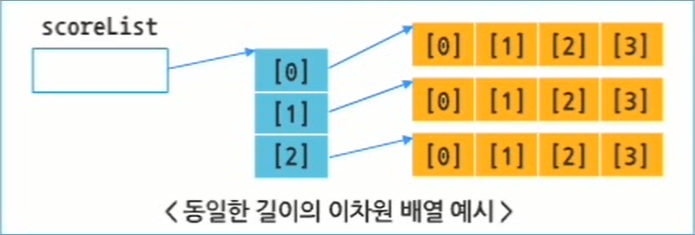
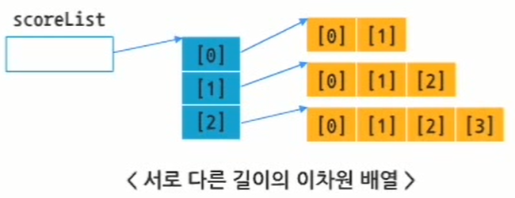

# 3. 자바 연산자 및 배열

## 3.1 자바 연산자

### 3.1.1 산술 연산자

- 산술 연산자
    - 정수형, 실수형에 사용됨
    - 사칙연산(`+`, `-`, `*`, `/`)과 나머지 연산이 가능
    - 종류
        1. 증감 연산자(단항)
            - `++값` : 값 1 증가 후 값을 취함
            - `값++` : 현재 값을 취한 후 값 1 증가
            - `--값` : 값 1 감소 후 값을 취함
            - `값--` : 현재 값을 취한 후 1 감소
            - 예시
              
                ```java
                int count = 1;
                int total = ++count;   // count와 total 둘 다 2
                int total = count++;   // total은 2, count는 3
                ```
            
        2. 부호 연산자(이항)
            - `+` : 덧셈
            - `-` : 뺄셈
            - `*` : 곱셈
            - `/` : 나눗셈
        3. 나머지 연산자(이항)
            - `%` : 정수의 몫을 취한 후 나머지를 구하는 연산
            - 예시
              
                ```java
                int money = 49800 % 1000;   // money는 800
                ```
    
- 산술 연산자 실습
    1. 예제 1
       
        ```java
        package sec01;
        
        public class ArithmeticOpTest1 {
        
        	public static void main(String[] args) {
        		// TODO Auto-generated method stub
        		
        		int num1 = 3;
        		int num2 = 20;
        		int num3, num4, num5, num6, num7;
        		
        		num3 = num2 + num1; // 덧셈
        		num4 = num2 - num1; // 뺄셈
        		num5 = num2 * num1; // 곱셈
        		num6 = num2 / num1; // 나눗셈
        		num7 = num2 % num1; // 나머지 리턴
        		
        		System.out.println("20+3= " + num3);
        		System.out.println("20-3= " + num4);
        		System.out.println("20*3= " + num5);
        		System.out.println("20/3= " + num6);
        		System.out.println("20%3= " + num7);
        
        	}
        
        }
        ```
        
        - 결과
          
            ```html
            20+3= 23
            20-3= 17
            20*3= 60
            20/3= 6
            20%3= 2
            ```
        
    2. 예제 2
       
        ```java
        package sec01;
        
        public class ArithmeticOpTest2 {
        
        	public static void main(String[] args) {
        		// TODO Auto-generated method stub
        		
        		int num = 3;
        		
        		System.out.println("++3= " + ++num);
        		System.out.println("3++= " + num++);
        		System.out.println(num);
        
        	}
        
        }
        ```
        
        - 결과
          
            ```html
            ++3= 4
            3++= 4
            5
            ```
            

### 3.1.2 비교 연산자

- 비교 연산자
    - 대소 비교나 객체의 타입 비교 등에 사용
    - 비교 연산을 수행한 결과에 따라 `true`나 `false`의 `boolean` 데이터 타입의 결과를 리턴함
    - 종류 : `>`, `>=`, `<`, `<=`, `==`, `!=`, `instanceof`
        - `a instanceof b` : a가 b 데이터 타입의 객체인 경우 `true`
    - 예시
      
        ```java
        int age = 28;
        boolean flag = age > 18;   // flag 변수에는 true 값이 할당됨
        System.out.println(flag);
        ```
    
- 비교 연산자 실습
  
    ```java
    package sec01;
    
    public class ComparisonOpTest {
    
    	public static void main(String[] args) {
    		// TODO Auto-generated method stub
    		
    		int num1 = 9;
    		int num2 = 13;
    		int num3 = 13;
    		
    		System.out.println("9>13: " + (num1 > num2));
    		System.out.println("9>=13: " + (num1 >= num2));
    		System.out.println("9<13: " + (num1 < num2));
    		System.out.println("9<=13: " + (num1 <= num2));
    		System.out.println("9==13: " + (num1 == num2));
    		System.out.println("13==13: " + (num2 == num3));
    		System.out.println("9!=13: " + (num1 != num2));
    
    	}
    
    }
    ```
    
    - 결과
      
        ```html
        9>13: false
        9>=13: false
        9<13: true
        9<=13: true
        9==13: false
        13==13: true
        9!=13: true
        ```
        

### 3.1.3 논리 연산자

- 논리 연산자
    - `boolean` 데이터 타입에 적용
    - 결과 값으로 `true` 또는 `false` 값을 가짐
    - 종류
      
      
        | 연산자 | 의미 |
        | --- | --- |
        | a & b | a와 b 모두 true인 경우만 true 리턴 |
        | a && b | a와 b 모두 true인 경우만 true 리턴
        단, a가 false이면 b를 수행하지 않고 false리턴 |
        | a | b | a와 b 중 하나라도 true면 true 리턴 |
        | a || b | a와 b 중 하나라도 true면 true 리턴
        단, a가 true이면 b를 수행하지 않고 true 리턴 |
        | !  a | 값이 true면 false로, false면 true로 변경 |
    - 단축 연산자 `&&`, `||`를 제공하여 보다 빠르게 연산 처리를 가능하게 함
    - 예시
      
        ```java
        int a = 30;
        int b = 20;
        int c = 5;
        boolean d = (a > b) && (a > c)  // true 리턴
        ```
        
        ```java
        int a = 20;
        int b = 30;
        int c = 5;
        boolean d = (a > b) && (a > c)  // false 리턴
        ```
    
- 논리 연산자 실습
  
    ```java
    package sec01;
    
    public class LogicalOpTest {
    
    	public static void main(String[] args) {
    		// TODO Auto-generated method stub
    		
    		int num1 = 9;
    		int num2 = 2;
    		int num3 = 0;
    		
    		System.out.println((num1 == num2) && ((num1 / num3) > 0));	// 오른쪽 연산 수행 없이 false 리턴
    		System.out.println((num1 == num2) & ((num1 / num3) > 0));	  // 오른쪽 연산이 문제가 있어 오류 발생
    		System.out.println((num1 == num2) || ((num1 / num3) > 0));	// 오른쪽 연산 수행 없이 true 리턴
    		System.out.println((num1 == num2) | ((num1 / num3) > 0));	  // 오른쪽 연산에 문제가 있어 오류 발생
    
    	}
    
    }
    ```
    
    - 결과
      
        ```html
        false
        Exception in thread "main" java.lang.ArithmeticException: / by zero
        	at sec01.LogicalOpTest.main(LogicalOpTest.java:13)
        ```
        

### 3.1.4 비트 연산자

- 비트 연산자
    - 값을 bit로 연산하는 연산자
    - 메모리를 최대한 효율적으로 활용해야 하는 경우 비트 단위로 데이터를 관리해야 함
    - 종류
      
      
        | 연산자 | 의미 |
        | --- | --- |
        | & | 논리곱 |
        | | | 논리합 |
        | ^ | 배타 논리합 |
        | ~ | 보수(not) |
        | >> | 오른쪽으로 시프트하고, 왼쪽에 현재 부호 비트가 채워짐 |
        | >>> | 오른쪽으로 시프트하고, 왼쪽에는 0이 채워짐 |
        | << | 왼쪽으로 시프트하고, 오른쪽에는 0이 채워짐 |
- 비트 연산자 실습
  
    ```java
    package sec01;
    
    public class BitOpTest {
    
    	public static void main(String[] args) {
    		// TODO Auto-generated method stub
    		
    		int a = 2;
    		int b = 5;
    		int c = a | b;
    		int d = a & b;
    		int e = a ^ b;
    		int i, j;
    		i = a << 2;
    		j = b >> 2;
    		
    		System.out.println("a= " + a);
    		System.out.println("b= " + b);
    		System.out.println("a|b= " + c);
    		System.out.println("a&b= " + d);
    		System.out.println("a^b= " + e);
    		System.out.println("a<<2= " + i);
    		System.out.println("b>>2= " + j);
    
    	}
    
    }
    ```
    
    - 결과
      
        ```html
        a= 2
        b= 5
        a|b= 7
        a&b= 0
        a^b= 7
        a<<2= 8
        b>>2= 1
        ```
        

### 3.1.5 기타 연산자 및 연산자 우선순위

- 대입 연산자
    - 변수에 값을 저장하기 위한 용도
    - 대입 연산자 `=`를 중심으로 오른쪽의 값을 왼쪽에 대입하여 사용
    - 예시
      
        ```java
        int score = 87;   // score에 87 대입
        score = 100;      // score에 100을 덮어씀
        System.out.println(score);  // score 값인 100 출력
        ```
        
    - 연산 후 대입 연산자도 지원
        - 예 : `int sum += 58;` = `'int sum = sum + 58;`
        - 가독성을 떨어뜨리기 때문에 가급적 사용하지 않음
    - 종류
      
      
        | 연산자 | 의미 |
        | --- | --- |
        | a = b | a에 b 대입 |
        | a += b | a = a + b |
        | a -= b | a = a - b |
        | a *= b | a = a * b |
        | a /= b | a = a / b |
        | a %= b | a = a % b |
        | a &= b | a = a & b |
        | a |= b | a = a | b |
        | a ^= b | a = a ^ b |
        | a <<= b | a = a << b |
        | a <<<= b | a = a <<< b |
        | a >>= b | a = a >> b |
- 조건 삼항 연산자
    - `?`, `:`
    - 조건 삼항 연산을 제공
    - 조건 제어문인 `if - else` 문장을 축약하여 사용 가능
        - `변수 = 조건 ? 값1 : 값2` : 조건이 참이면 값1을, 거짓이면 값2를 변수에 대입
    - 예시
      
        ```java
        int score = 78;
        boolean passYn;
        passYn = (score > 80) ? true : false;  // 조건이 거짓이므로 passYn에 false 대입
        ```
    
- 연산자 우선순위
    - 연산자의 우선순위는 고정
    - 최우선 연산자를 이용하여 먼저 처리될 연산자를 묶어서 처리하는 것이 가독성을 높일 수 있음
    - 우선순위
        1. `()`, `[]`, `.`
        2. `++`, `--`, `~`, `!`
        3. `*`, `/`, `%`
        4. `+`, `-`
        5. `>>`, `>>>`, `<<`
        6. `>`, `>=`, `<`, `<=`
        7. `==`, `!=`
        8. `&`
        9. `^`
        10. `|`
        11. `&&`
        12. `||`
        13. `?`, `:`
        14. `=`, 대입 연산자

## 3.2 자바의 배열

### 3.2.1 배열의 개념

- 배열
    - 같은 타입의 데이터들의 모임
    - 메모리가 절약되고, 쉽고 간결하게 프로그램을 작성할 수 있음
- 참조형의 메모리 할당과 구조
  
    ```java
    String greeting;
    greeting = new String("Hello, Java!");
    ```
    
    - Hello, Java!라는 String Object를 생성하고, greeting 객체에 String Object의 주소 값을 할당
- 일차원 배열의 선언과 사용
    - 사용 순서
        1. 배열 객체를 참조할 배열 변수 선언
           
            ```java
            데이터 타입 배열 변수명 [];
            또는
            데이터 타입 [] 배열 변수명;
            ```
            
        2. 배열 객체 생성
           
            ```java
            배열 변수명 = new 데이터 타입 [배열의 길이];
            ```
            
        - 배열 변수 선언과 객체 생성을 한 문장으로 표현 가능
          
            ```java
            데이터 타입 배열 변수명 [] = new 데이터 타입 [배열의 길이];
            또는
            데이터 타입 [] 배열 변수명 = new 데이터 타입 [배열의 길이];
            ```
            
        - 배열 변수 선언과 객체 생성, 초기화를 한 문장으로 표현 가능
          
            ```java
            int[] scoreList = {45, 80, 100, 59, 80};
            또는
            scoreList = new int[] {45, 80, 100, 59, 80};
            ```
    
- 예약어 `length`
    - 배열의 길이를 확인하는데 사용
    - 배열의 길이를 알아야 하는 이유는 배열의 길이를 파악해야 배열에 저장된 데이터 수만큼 반복 처리를 할 수 있기 때문
    - 구문
      
        ```java
        배열 변수명.length;
        ```
        
    - 예시
      
        ```java
        System.out.println(scoreList.length);
        String flag = (scoreList.length != 50) ? "같지 않다" : "같다";
        ```
    
- 인덱스(index)
    - 배열에 저장된 값을 참조하고자 할 때 해당 배열 변수 이름과 인덱스 이용
    - 인덱스 번호는 0부터 시작
      
        → 인덱스 번호는 배열의 `length`보다 작은 번호만이 유효
        
    - 예시
      
        ```java
        int [] scoreList = new int [100];
        scoreList[0] = 1;
        scoreList[99] = 100;
        System.out.println(scoreList[0]);  // 1 리턴
        System.out.println(scoreList[99]); // 100 리턴
        
        scoreList[100] = 98;  //100번째 인덱스는 존재하지 않아 오류 발생
        ```
    
- 일차열 배열 실습
    1. 예제 1-1
       
        ```java
        package sec02;
        
        public class BasicArrayTest {
        
        	public static void main(String[] args) {
        		// TODO Auto-generated method stub
        		
        		int[] scoreList;
        		scoreList = new int[5];
        		
        		scoreList[0] = 80;
        		scoreList[1] = 95;
        		scoreList[2] = 68;
        		scoreList[3] = 100;
        		scoreList[4] = 54;
        		
        		System.out.println("scoreList 길이는 " + scoreList.length);
        		
        		System.out.println("scoreList 배열 요소 출력");
        		
        		System.out.print(scoreList[0] + "\t");
        		System.out.print(scoreList[1] + "\t");
        		System.out.print(scoreList[2] + "\t");
        		System.out.print(scoreList[3] + "\t");
        		System.out.print(scoreList[4]);
        
        	}
        
        }
        ```
        
        - 결과
          
            ```html
            scoreList 길이는 5
            scoreList 배열 요소 출력
            80	95	68	100  54
            ```
        
    2. 예제 1-2(간단 작성)
       
        ```java
        package sec02;
        
        public class BasicArrayTest2 {
        
        	public static void main(String[] args) {
        		// TODO Auto-generated method stub
        		
        		int[] scoreList = {80, 95, 68, 100, 54};
        		
        		System.out.println("scoreList 길이는 " + scoreList.length);
        		
        		System.out.println("scoreList 배열 요소 출력");
        		
        		System.out.print(scoreList[0] + "\t");
        		System.out.print(scoreList[1] + "\t");
        		System.out.print(scoreList[2] + "\t");
        		System.out.print(scoreList[3] + "\t");
        		System.out.print(scoreList[4]);
        
        	}
        
        }
        ```
        
    3. 예제 2-1
       
        ```java
        package sec02;
        
        public class ObjectArrayTest {
        
        	public static void main(String[] args) {
        		// TODO Auto-generated method stub
        		
        		String nameList[];
        		nameList = new String[3];
        		
        		nameList[0] = "Java";
        		nameList[1] = "SQL";
        		nameList[2] = "Servlet";
        		
        		System.out.println("nameList의 길이는 " + nameList.length);
        		
        		System.out.println("nameList 배열 요소 출력");
        		System.out.print(nameList[0] + "\t");
        		System.out.print(nameList[1] + "\t");
        		System.out.println(nameList[2]);
        
        	}
        
        }
        ```
        
        - 결과
          
            ```html
            nameList의 길이는 3
            nameList 배열 요소 출력
            Java	SQL	Servlet
            ```
        
    4. 예제 2-2(간단 작성)
       
        ```java
        package sec02;
        
        public class ObjectArrayTest2 {
        
        	public static void main(String[] args) {
        		// TODO Auto-generated method stub
        		
        		String nameList[] = {"Java", "SQL", "Servlet"};
        		
        		System.out.println("nameList의 길이는 " + nameList.length);
        		
        		System.out.println("nameList 배열 요소 출력");
        		System.out.print(nameList[0] + "\t");
        		System.out.print(nameList[1] + "\t");
        		System.out.println(nameList[2]);
        
        	}
        
        }
        ```
        

### 3.2.2 다차원 배열

- 이차원 배열
    - 일차원 배열을 여러 개 사용하여 다시 배열을 구현한 것
    - 다차원 배열 = 배열의 배열
    - 선언 구문
      
        ```java
        데이터 타입 배열 변수명 [][];
        또는
        데이터 타입 [][] 배열 변수명;
        또는
        데이터 타입 [] 배열 변수명[];
        ```
    
- 이차열 배열의 선언과 사용
    - 사용 과정
        1. 배열 객체를 참조할 배열 변수 선언
            - 구문
              
                ```java
                배열 변수명 = new 데이터 타입 [배열의 배열 길이] [배열 길이];
                또는
                배열 변수명 = new 데이터 타입 [배열의 배열 길이] [];
                배열 변수명[인덱스 번호] = new 데이터 타입 [배열 길이];
                ```
            
        2. 배열 객체 생성
            1. 동일한 길이로 생성된 일차원 배열을 참조하는 형태
               
                ```java
                scoreList = new int[3][4];
                또는
                scoreList = new int[3][];
                scoreList[0] = new int[4];
                scoreList[1] = new int[4];
                scoreList[2] = new int[4];
                ```
                
                
                
                - 예제
                  
                    ```java
                    package sec02;
                    
                    public class TwoDArrayTest1 {
                    
                    	public static void main(String[] args) {
                    		// TODO Auto-generated method stub
                    		
                    		String [][] scoreList = new String[3][4];
                    		
                    		System.out.println("<2차원 배열의 인덱스 출력>");
                    		
                    		for(int i=0;i<scoreList.length;i++) {
                    			for(int j=0;j<scoreList[i].length;j++) {
                    				scoreList[i][j] = "[" + i + "][" + j + "]요소";
                    				System.out.print(scoreList[i][j] + "\t");
                    			}
                    			System.out.println("");
                    		}
                    
                    	}
                    
                    }
                    ```
                    
                - 결과
                  
                    ```html
                    <2차원 배열의 인덱스 출력>
                    [0][0]요소	[0][1]요소	[0][2]요소	[0][3]요소	
                    [1][0]요소	[1][1]요소	[1][2]요소	[1][3]요소	
                    [2][0]요소	[2][1]요소	[2][2]요소	[2][3]요소
                    ```
                
            2. 서로 다른 길이로 생성된 일차원 배열을 참조하는 형태
               
                ```java
                int[][] scoreList = new int[3][];
                scoreList[0] = new int[2];
                scoreList[1] = new int[3];
                scoreList[2] = new int[4];
                ```
                
                
                
                - 예제
                  
                    ```java
                    package sec02;
                    
                    public class TwoDArrayTest2 {
                    
                    	public static void main(String[] args) {
                    		// TODO Auto-generated method stub
                    		
                    		String[][] scoreList = new String[3][];
                    		
                    		scoreList[0] = new String[2];
                    		scoreList[1] = new String[3];
                    		scoreList[2] = new String[4];
                    		
                    		System.out.println("<2차원 배열의 인덱스 출력>");
                    		
                    		for(int i=0; i<scoreList.length;i++) {
                    			for(int j=0; j<scoreList[i].length;j++) {
                    				scoreList[i][j] = "[" + i + "][" + j + "]요소";
                    				
                    				System.out.print(scoreList[i][j] + "\t");
                    			}
                    			System.out.println(" ");
                    		}
                    
                    	}
                    
                    }
                    ```
                    
                - 결과
                  
                    ```html
                    <2차원 배열의 인덱스 출력>
                    [0][0]요소	[0][1]요소	 
                    [1][0]요소	[1][1]요소	[1][2]요소	 
                    [2][0]요소	[2][1]요소	[2][2]요소	[2][3]요소
                    ```
    
- `main()` 메서드
    - 자바 애플리케이션에 필수적으로 있어야 하고, 애플리케이션이 실행될 때 자동으로 실행되는 메서드
    - 자바 애플리케이션을 작성하고 실행하기 위해서는 클래스를 정의하고 `main()` 메서드를 정의해야 함
    - 일반적인 작업 과정
      
        `main()` 메서드 내에서 다른 클래스 객체 생성 → 객체의 메서드 호출 또는 객체의 변수 조작 → 자바 애플리케이션의 원하는 결과 획득
    
- 명령행 매개변수
    - 예제
      
        ```java
        package sec02;
        
        public class CommandLineArgTest {
        
        	public static void main(String[] args) {
        		// TODO Auto-generated method stub
        		
        		// 실행될 코드
        
        	}
        
        }
        ```
        
        - `main(String[] args)` : 문자열의 배열을 매개변수로 받아 프로그램 실행 시 필요한 정보를 프로그램에 전달
        - `String[] args` : 명령행 매개변수
    - 사용자가 명령행 매개변수로 입력한 문자열의 순서에 따라 차례대로 배열에 저장됨
      
        ```java
        java CommandLineArgTest arg1 arg2
        ```
        
        - 공백을 구분자로 하여 여러 개의 값을 전달함
    - 명령형 매개변수에 해당하는 배열은 문자열 타입
      
        ⇒ 숫자 사용 시 문자열을 숫자로 변환해야 함
        
    - 자바 API에서 숫자로 변환하는 메서드 제공
        - 정수 형태로 변환 : `parseInt()`
        - 실수 형태로 변환 : `parseDouble()`
- 명령행 매개변수 예시
  
    ```java
    package sec02;
    
    public class CommandLineArgTest {
    
    	public static void main(String[] args) {
    		// TODO Auto-generated method stub
    		
    		int num1 = Integer.parseInt(args[0]);
    		int num2 = Integer.parseInt(args[1]);
    		
    		int sum = num1 + num2;
    		
    		System.out.println("매개변수로 받는 정수의 합 : " + sum);
    
    	}
    
    }
    ```
    
- 명령행 매개변수가 필요한 프로그램 실행
    1. 도스
       
        ```java
        C:\javatest> javac CommandLineArgTest.java
        
        C:\javatest> java CommandLineArgTest 변수1 변수2 ...
        ```
        
    2. 이클립스
        1. 코드 작성
        2. 우클릭 한 후 [Run As] - [Run Configurations...] 클릭
        3. [Arguments] 탭에서 [Program arguments] 칸에 값 입력
- 배열 예제
  
    ```java
    package sec02;
    
    public class ArrayTest {
    
    	public static void main(String[] args) {
    		// TODO Auto-generated method stub
    		
    		int [] javaScore = new int[5];
    		
    		// 1. 명령행 매개변수로 들어온 5개의 자바 점수를 배열에 저장
    		javaScore[0] = Integer.parseInt(args[0]);
    		javaScore[1] = Integer.parseInt(args[1]);
    		javaScore[2] = Integer.parseInt(args[2]);
    		javaScore[3] = Integer.parseInt(args[3]);
    		javaScore[4] = Integer.parseInt(args[4]);
    		
    		// 2. 배열에 저장된 자바 점수 총합 구하기
    		int sumScore = 0;
    		sumScore = javaScore[0] + javaScore[1] + javaScore[2] + javaScore[3] + javaScore[4];
    		
    		// 3. 자바 점수의 평균 구하기
    		double avgScore = 0.0;
    		avgScore = (double)sumScore/javaScore.length;
    		
    		
    		// 출력
    		System.out.println("자바 점수의 총합 : " + sumScore);
    		System.out.println("자바 점수의 평균 : " + avgScore);
    
    	}
    
    }
    ```
    

---