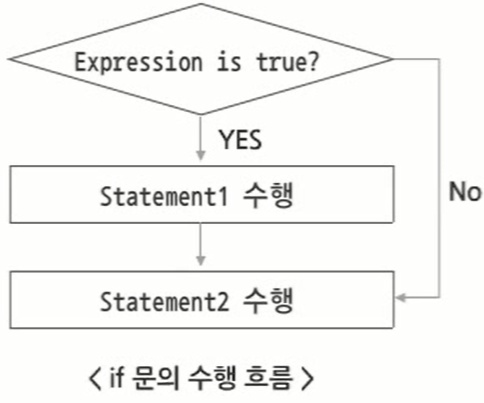
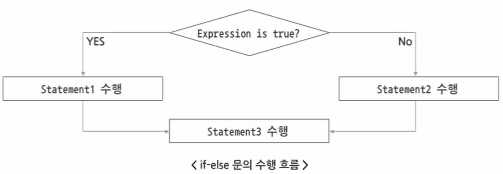
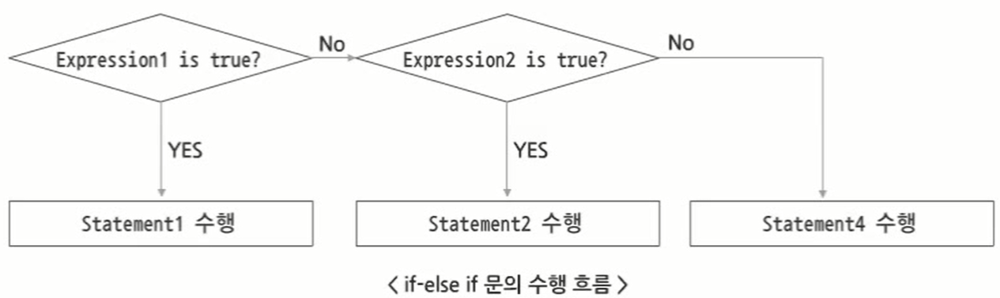
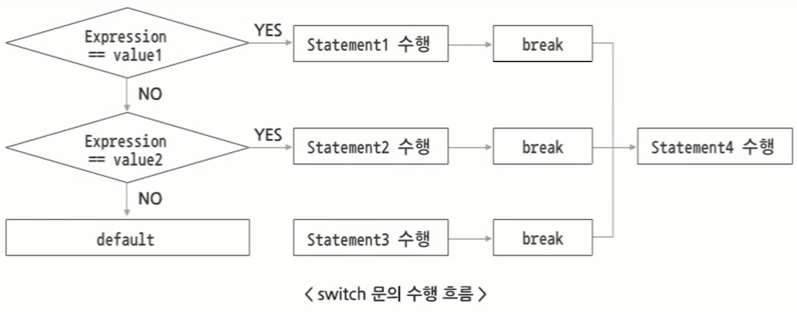
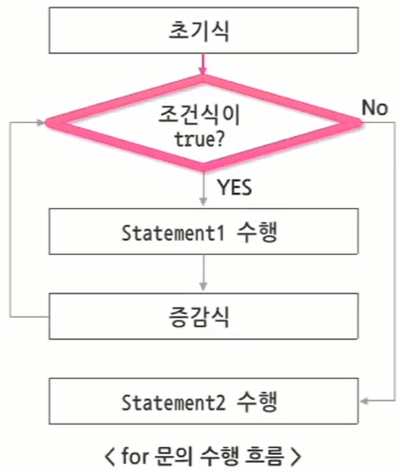
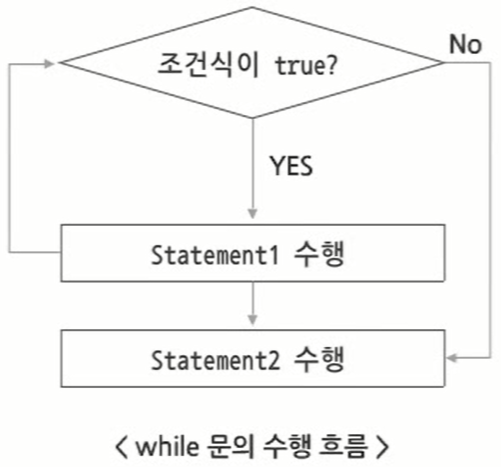
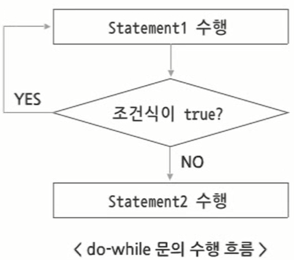

# 자바 제어문

# 4. 자바 제어문

## 4.1 자바 제어문

### 4.1.1 조건 제어문

- 조건 제어문
    - 특정 조건을 만족할 경우 문장을  수행함
    - 구분
        1. 조건에 따른 단순 분기 처리 : `if`, `if` & `else`
        2. 조건에 따른 다중 분기 처리 : `if`& `else if`, `switch`
    - 조건 제어문은 조건식을 포함해야 함
        - `if`, `if` & `else`, `if` & `else if` : `true`와 `false`를 리턴하는 조건식 필요
        - `switch` : case에 해당하는 값이 필요
- `if` 문
    - 조건에 따라 선택적으로 문장이 수행되는 분기문 처리 시에 사용
    - 특정 조건에 부합되면 해당 문장 실행
    - 특정 조건에 부합되지 않으면 다음 수행 구문으로 넘어감
      
        
        
    - 구문
      
        ```java
        if(Expression){
        	Statement 1;
        }
        ```
    
- `if` 문 예제
  
    ```java
    package sec01;
    
    public class IfTest {
    
    	public static void main(String[] args) {
    		// TODO Auto-generated method stub
    		
    		int num = 10;
    		
    		if((num % 2) == 0) {
    			System.out.println(num + "은 짝수이다.");
    		}
    		
    		if((num % 2) != 0) {
    			System.out.println(num + "은 홀수이다.");
    		}
    
    	}
    
    }
    ```
    
    - Statement가 한 줄이면 블록 생략 가능
    - 결과
      
        ```html
        10은 짝수이다.
        ```
    
- `if-else` 문
    - 조건식이 `true`인지 `false`인지에 따라 특정 구문만 수행되도록 처리할 때 사용
      
        
        
    - 구문
      
        ```java
        if(Expression){
        	Statement 1;
        } else {
        	Statement 2;
        }
        ```
    
- `if-else`문 예제
  
    ```java
    package sec01;
    
    public class IfElseTest {
    
    	public static void main(String[] args) {
    		// TODO Auto-generated method stub
    		
    		int num = 17;
    		
    		if((num % 2) == 0) {
    			System.out.println(num + "은 짝수이다.");
    		} else {
    			System.out.println(num + "은 홀수이다.");
    		}
    
    	}
    
    }
    ```
    
    - Statement가 한 줄이면 블록 생략 가능
    - 결과
      
        ```html
        17은 홀수이다.
        ```
    
- `if-else if` 문
    - 여러 개의 조건에 따른 다중 선택이 필요할 대 사용
      
        
        
    - 구문
      
        ```java
        if(Expression 1){
        	Statement 1;
        } else if(Expression 2){
        	Statement 2;
        } else (Expression 3){
        	Statement 3;
        }
        ```
    
- `if-else if` 문 예제
  
    ```java
    package sec01;
    
    public class IfElseIfTest {
    
    	public static void main(String[] args) {
    		// TODO Auto-generated method stub
    		
    		int month = Integer.parseInt(args[0]);
    		
    		if(month == 3 || month == 4 || month == 5) {
    			System.out.println(month + "월은 봄이다.");
    		} else if(month == 6 || month == 7 || month == 8) {
    			System.out.println(month + "월은 여름이다.");
    		} else if(month == 9 || month == 10 || month == 11) {
    			System.out.println(month + "월은 가을이다.");
    		} else if(month == 12 || month == 1 || month == 2){
    			System.out.println(month + "월은 겨울이다.");
    		} else {
    			System.out.println("1과 12 사이의 숫자만 입력하시오.");
    		}
    
    	}
    
    }
    ```
    
- `switch` 문
    - 다중 분기 처리 시 사용
      
        
        
    - 조건문의 결과는 `char`, `byte`, `shor`, `int` 형만 가능
    - 구문
      
        ```java
        switch(Expression){
        	case value 1 : 
        		Statement 1;
        		break;
        	case value 2 : 
        		Statement 2;
        		break;
        	default : 
        		Statement 3;
        		break;
        }
        Statement 4;
        ```
        
        - `break` 문이 없으면 `break` 문이 나타나거나 `switch` 블록이 끝날 때까지 다음 `case` 문에 대한 문장을 차례대로 수행해야 함
- `switch` 문 예제
  
    ```java
    package sec01;
    
    public class SwitchTest {
    
    	public static void main(String[] args) {
    		// TODO Auto-generated method stub
    		
    		int month = Integer.parseInt(args[0]);
    		switch(month) {
    		case 3:
    		case 4:
    		case 5:
    			System.out.println(month + "월은 봄이다.");
    			break;
    			
    		case 6:
    		case 7:
    		case 8:
    			System.out.println(month + "월은 여름이다.");
    			break;
    			
    		case 9:
    		case 10:
    		case 11:
    			System.out.println(month + "월은 가을이다.");
    			break;
    			
    		case 12:
    		case 1:
    		case 2:
    			System.out.println(month + "월은 겨울이다.");
    			break;
    		
    		default:
    			System.out.println("1과 12 사이의 숫자만 입력하시오.");
    			break;
    		}
    
    	}
    
    }
    ```
    

### 4.1.2 반복 제어문

- 반복 제어문
    - 반복적으로 특정 문장을 수행함
    - 구분
        - 조건에 따라 특정 문장이 수행되지 않는 반복문 : `for`, `while`
        - 무조건 한 번 이상 수행되는 반복문 : `do-while`
    - 반복 제어문은 조건식을 포함해야 함
        - `for`, `while` 문에 사용되는 조건식의 연산 결과는 `true` 또는 `false`를 사용
- `for` 문
    - 구문
      
        ```java
        for(초기식; 조건식; 증감식){
        	Statement 1;
        }
        Statement 2;
        ```
        
    - 흐름도
      
        
        
    - `for` 블록 내 선언된 변수는 `for` 블록 내부에서만 사용 가능
    - `for` 블록을 포함하는 메서드 내에서 선언된 변수와 같은 이름으로 선언할 수 없음
    - 사용 예시
      
        ```java
        package sec01;
        
        public class ForTest {
        
        	public static void main(String[] args) {
        		// TODO Auto-generated method stub
        		
        		for(int i=0; i<10; i++) {
        			System.out.println("숫자 : " + i);
        			
        			int i = 20;  // Error 발생
        		}
        		System.out.println("최종 증가된 i값 : " + i);  // Error 발생
        
        	}
        
        }
        ```
        
    - 증감식이 없으면 반복문이 종료되지 못하고 무한 반복
- `for` 문 예제
    1. 예제 1
       
        ```java
        package sec01;
        
        public class ForTest1 {
        
        	public static void main(String[] args) {
        		// TODO Auto-generated method stub
        		
        		int sum = 0;
        		for (int i=1; i <= 100; i++) {
        			if((i % 2) == 0) {
        				sum = sum + i;
        			}
        		}  // 1부터 100까지 짝수만 더하는 반복문
        		
        		System.out.println("1부터 100 사이 짝수의 합 : " + sum);
        
        	}
        
        }
        ```
        
        - 결과
          
            ```html
            1부터 100 사이 짝수의 합 : 2550
            ```
        
    2. 예제 2(이중 반복문)
       
        ```java
        package sec01;
        
        public class ForTest2 {
        
        	public static void main(String[] args) {
        		// TODO Auto-generated method stub
        
        		for (int i = 0; i <= 10; i++) {
        			for (int j = 0; j <= i; j++) {
        				System.out.print("*"); // * 출력 반복문
        			}
        			System.out.println(""); // 개행 처리
        		}
        
        	}
        
        }
        ```
        
        - 결과
          
            ```html
            *
            **
            ***
            ****
            *****
            ******
            *******
            ********
            *********
            **********
            ***********
            ```
    
- `while` 문
    - 구문
      
        ```java
        while(조건식) {
        	Statement 1;
        }
        Statement 2;
        ```
        
    - 흐름도
      
        
        
    - 조건식이 `true`인 동안 조건식 내 변수를 증가시키는 등 조건식이 어느 시점에서 `false`가 되도록 작성해야 함
- `while`문 예제
  
    ```java
    package sec01;
    
    public class WhileTest {
    
    	public static void main(String[] args) {
    		// TODO Auto-generated method stub
    		
    		int i = 1;
    		int sum = 0;
    		
    		while(i <= 100) {
    			if((i % 2) == 0) {
    				sum = sum + i;
    			}
    			++i;
    		}
    		
    		System.out.println("1부터 100 사이 짝수의 합 : " + sum);
    
    	}
    
    }
    ```
    
    - 결과
      
        ```html
        1부터 100 사이 짝수의 합 : 2550
        ```
    
- `do-while` 문
    - `while`문과 비슷하나, 반복문을 제어하는 식이 반복 블록 다음에 있음
    - 반복 블록이 조건식 앞에 있으므로, 조건식이 `false`라도 반복문을 최소 한 번은 실행함
    - 구문
      
        ```java
        do {
        	Statement 1;
        } while(조건식);
        	Statement 2;
        ```
        
    - 흐름도
      
        
    
- `do-while` 문 예제
  
    ```java
    package sec01;
    
    public class DoWhileTest {
    
    	public static void main(String[] args) {
    		// TODO Auto-generated method stub
    
    		int i = 102;
    		int sum = 0;
    
    		do {
    			if ((i % 2) == 0) {
    				sum = sum + i;
    			}
    			++i;
    		} while (i <= 100);
    
    		System.out.println("1부터 100 사이 짝수의 합 : " + sum);
    
    	}
    
    }
    ```
    
    - 결과
      
        ```html
        1부터 100 사이 짝수의 합 : 102
        ```
        

### 4.1.3 이동 제어문

- 이동 제어문
    - 수행 흐름을 원하는 곳으로 이동시킬 때 사용
    - 종류
        1. `break`
            - `switch`문에서 쓰일 경우 수행을 중단하고 `switch`블록을 종료
            - 반복문에서 쓰일 경우 수행을 중단하고 반복문 자체를 종료
        2. `continue`
            - 반복문(`for`, `while`)에서 현재 단계의 수행을 생략하고 다음 단계로 계속 진행
        3. `return`
            - 메서드의 수행을 종료하고 메서드가 호출된 곳으로 제어를 이동시킴
- `break`문
    - 반복문을 빠져 나오는데 사용
    - 사용 예시
      
        ```java
        int sum = 0;
        
        for (int i = 0; i < 10; i++){
        	if (i == 5){
        		break;  // i 변수가 5가 되는 순간 반복문 종료
        	}
        	sum = sum + i;
        	System.out.println("i value = " + i);
        }
        
        System.out.println("sum = " + sum);
        ```
    
- `break`문 예제
    1. 예제 1
       
        ```java
        package sec01;
        
        public class BreakTest {
        
        	public static void main(String[] args) {
        		// TODO Auto-generated method stub
        
        		int[] scoreList = { 98, 57, 49, 100, 99, 85, 77 };
        		int maxScore = 300;
        		int scoreSum = 0;
        
        		for (int i = 0; i < scoreList.length; i++) {
        			scoreSum = scoreSum + scoreList[i];
        
        			if (scoreSum > maxScore) {
        				scoreSum = scoreSum - scoreList[i]; // 누적 값이 300을 넘으면 마지막에 누적한 값을 차감한 후 반복문 종료
        				break;
        			}
        		}
        
        		System.out.println("scoreSum = " + scoreSum);
        
        	}
        
        }
        ```
        
        - 결과
          
            ```html
            scoreSum = 204
            ```
        
    2. 예제 2(이중 반복문에서 `break`)
       
        ```java
        package sec01;
        
        public class BreakTest2 {
        
        	public static void main(String[] args) {
        		// TODO Auto-generated method stub
        		
        		for (int i = 0; i < 10; i++) {
        			for (int j = 0; j < 10; j++) {
        				System.out.print("*");
        				
        				if (i == j) {
        					break;
        				}
        			}
        			
        			System.out.println("");
        		}
        
        	}
        
        }
        ```
        
        - 결과
          
            ```html
            *
            **
            ***
            ****
            *****
            ******
            *******
            ********
            *********
            **********
            ```
    
- `continue`문
    - 반복문의 조건부로 실행 위치를 옮김
    - `continue`뒤에 위치한 실행문은 실행되지 않음
    - 사용 예시
      
        ```java
        int sum = 0;
        
        for (int i = 0; i < 10; i++){
        	if (i == 5){
        		continue;  // i 값이 5가 되면 실행문을 실행하지 않고 값만 하나 증가하여 다시 조건문으로 돌아감
        	}
        	sum = sum + i;
        	System.out.println("i value = " + i);
        }
        System.out.println("sum = " + sum); // 누적 값은 5를 제외한 누적 값이 출력됨
        ```
    
- `continue`문 예제
  
    ```java
    package sec01;
    
    public class ContinueTest {
    
    	public static void main(String[] args) {
    		// TODO Auto-generated method stub
    		
    		int [] scoreList = {98, 57, 49, 100, 99, 85, 77};
    		int scoreSum = 0;
    		
    		for (int i = 0; i < scoreList.length; i++) {
    			if((scoreList[i] % 2) != 0) {
    				continue;
    			}
    			
    			scoreSum = scoreSum + scoreList[i];
    		}
    		
    		System.out.println("scoreSum = " + scoreSum);
    
    	}
    
    }
    ```
    
    - 결과
      
        ```html
        scoreSum = 198
        ```
    
- `Label`을 사용한 `break`와 `continue`
    - `Label`을 사용하면 `Label`이 정의된 영역만큼 `break`와 `continue`가 적용됨
    - 구문
      
        ```java
        특정 반복문에 Label 설정
        Label : 반복문;
        
        특정 Label로 break 설정
        break [Label];  // label로 명시된 블록을 빠져나가는데 사용
        
        특정 Label로 continue 설정
        continue [Label];  // label이 있는 라인으로 점프
        ```
        
    - 프로그램이 복잡해져 사용을 권장하지 않음
- `Label` 예제
    1. `break`
       
        ```java
        package sec01;
        
        public class LabelTest {
        
        	public static void main(String[] args) {
        		// TODO Auto-generated method stub
        		
        		outer: for (int i = 0; i < 4; i++) {
        			for (int j = 0; j < 3; j++) {
        				if (i == 2)
        					break outer;
        					System.out.println("i = " + i + " j = " + j);
        			}
        		}
        
        	}
        
        }
        ```
        
        - 결과
          
            ```html
            i = 0 j = 0
            i = 0 j = 1
            i = 0 j = 2
            i = 1 j = 0
            i = 1 j = 1
            i = 1 j = 2
            ```
        
    2. `continue`
       
        ```java
        package sec01;
        
        public class LabelTest2 {
        
        	public static void main(String[] args) {
        		// TODO Auto-generated method stub
        		
        		outer: for (int i = 0; i < 4; i++) {
        			for (int j = 0; j < 3; j++) {
        				if (i == 2)
        					continue outer;
        				System.out.println("i = " + i + " j = " + j);
        			}
        		}
        
        	}
        
        }
        ```
        
        - 결과
          
            ```html
            i = 0 j = 0
            i = 0 j = 1
            i = 0 j = 2
            i = 1 j = 0
            i = 1 j = 1
            i = 1 j = 2
            i = 3 j = 0
            i = 3 j = 1
            i = 3 j = 2
            ```
    
- `return`문
    - 현재 수행중인 메서드의 수행을 중단하고 이 메서드를 호출한 곳으로 제어를 반환
- `return`문 예제
    1. 예제 1
       
        ```java
        package sec01;
        
        public class ReturnTest1 {
        
        	public static void main(String[] args) {
        		// TODO Auto-generated method stub
        		
        		System.out.println("main() 메서드 시작");
        		
        		methodA();
        		
        		System.out.println("main() 메서드 종료");
        
        	}
        	
        	private static void methodA() {
        		System.out.println("methodA() 메서드 시작");
        		
        		for (int i = 0; i < 5; i++) {
        			if (i == 3) {
        				return; // i=3인 경우 메인 메서드에서 호출한 라인으로 이동
        			}
        			
        			System.out.println(i);
        		}
        		
        		System.out.println("methodA() 메서드 종료");
        	}
        
        }
        ```
        
        - 결과
          
            ```html
            main() 메서드 시작
            methodA() 메서드 시작
            0
            1
            2
            main() 메서드 종료
            ```
        
    2. 예제 2
       
        ```java
        package sec01;
        
        public class ReturnTest2 {
        
        	public static void main(String[] args) {
        		// TODO Auto-generated method stub
        
        		int[] scoreList = { 34, 56, 21, 73, 5, 17, 98 };
        		double avgScore = calcAvg(scoreList);
        
        		System.out.println("평균 점수 : " + avgScore);
        
        	}
        
        	private static double calcAvg(int[] scoreList) {
        		int sum = 0;
        
        		for (int i = 0; i < scoreList.length; i++) {
        			sum = sum + scoreList[i];
        		}
        
        		return (double) sum / scoreList.length; // 계산된 평균 점수를 리턴
        	}
        
        }
        ```
        
        - 결과
          
            ```html
            평균 점수 : 43.42857142857143
            ```
            

---